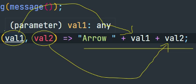

02-03 수업 내용 
================================
# chap03-javascript-es6-main
## 02.arrow-function

### 01.arrow-function-basic-syntax.js

#### 화살표 함수
- ES6에서 도입된 화살표함수(arrow function)는 function 키워드 대신, 
  화살표를 사용해 좀 더 간략한 방법으로 함수를 선언할 수 있다.
- 화살표 함수는 항상 익명함수로 정의한다.
- 본문이 한줄인 함수를 작성할 때 유용하다.

``` javascript
let message;

// 일반적인 함수
message = function() {
    return "Hello World!";
}

console.log(message());

// 화살표 함수
message = () => {
    return "Arrow Function";
}

console.log(message());


// 명령문이 하나만 있을 경우 중괄호 생략이 가능하고,
// 함수 몸체 내부의 문이 값으로 평가될 수 있는 표현식인 문이라면 암묵적으로 반환을 한다.
// 고로 return 키워드 생략이 가능하다.
message = () => "Arrow Function are Simple!";

console.log(message());
```

##### 화살표 함수의 특징
- 명령문이 하나만 있을 경우 중괄호 생략이 가능하고,
  함수 몸체 내부의 문이 값으로 평가될 수 있는 표현식인 문이라면 암묵적으로 반환을 한다.
- 고로 return 키워드 생략이 가능하다.
- 내부 동작이 간결해지기 때문에 장점으로 코드가 줄어들고 가독성이 좋아진다.

##### 매개변수가 있을 경우
- 매개변수가 하나면 소괄호 생략이 가능하다.
- 단 매개변수가 없거나 여러 개 일 경우 생략이 불가능하다.
- 또한, 소괄호로 감싸지 않을 경우 함수 몸체 중괄호로 잘못 해석하게 된다. 


``` javascript
message = (val1, val2) => "Arrow " + val1 + val2;
// val1과 val2에 인자를 주어 문자열 합치기 형태로  결과를 표출할 수 있다.
console.log(message('Function', '!')); // 결과 : Arrow Function!

// 매개변수가 하나면 소괄호 생략이 가능하다.
// 단 매개변수가 없거나 여러 개 일 경우 생략이 불가능하다.
message = val => "Arrow " + val;
console.log(message('Function are GOOD!!!')); // 결과 : Arrow Function are GOOD!!!

// 객체 리터럴을 반환하는 경우 소괄호를 감싼다.
const createUser = (id, name) => ({id, name});
console.log(createUser(1, '유관순')); // 결과 : { id: 1, name: '유관순' }

// 주의점!
// 소괄호로 감싸지 않을 경우 함수 몸체 중괄호로 잘못 해석하게 된다. 
const createUser2 = (id, name) => {id, name}; // 오류 발생 <- 소괄호를 제거하면 원하는 대로 해석을 하지 못한다.
console.log(createUser2(1, '유관순')); // 결과 : { id: 1, name: '유관순' }

// 순회하며 계산식 표현
// 1. 일반적인 순회
console.log([1, 2, 3, 4, 5].map(function(val) { return val * 10})); // 결과 : [ 10, 20, 30, 40, 50 ]

// 2. 화살표 함수를 사용한 순회
// 명령문이 하나일 때만 가능하다.
console.log([1, 2, 3, 4, 5].map(val => val * 10)); // 결과 : [ 10, 20, 30, 40, 50 ]
```

### 02.arrow-function-features.js

#### 화살표 함수와 기본 함수의 차이점

##### 1. 화살표 함수는 this를 가지지 않는다.
- 이러한 특징은 객체의 메서드 안에서 동일한 객체의 프로퍼티를 대상으로 순회하는데 사용할 수 있다.

###### 기본 함수 사용
``` javascript
let theater = {

    store : "건대점",
    titles : ["어벤져스", "겨울왕국", "스파이더맨", "라이온킹", "알라딘"],
    showMovieList() {

        this.titles.forEach(function(title)) {

            console.log(this.store + " : " + title);
        }
    }
}
theater.showMovieList(); // 얘의 store는 undefined
```

###### 화살표 함수 사용
``` javascript
// 화살표 함수 본문에서 this에 접근하면 외부에서 값을 가져오기 때문에 this.store는 theater.store "건대점" 이 된다.
let theater2 = {

    store : "건대점",
    titles : ["어벤져스", "겨울왕국", "스파이더맨", "라이온킹", "알라딘"],
    showMovieList() {

        this.titles.forEach(title => console.log(this.store + " : " + title));
    }
}
theater2.showMovieList(); // 얘는 store에 정상적으로 건대점이 들어간다.
```
- 즉, 일반 함수는 해당 {} 내부의 this를 바라보는데,
  화살표 함수는 외부의 값을 가져오기 때문에 차이가 있다.

##### 2. 화살표 함수는 new와 함께 호출할 수 없다.
- 생성자가 없어서 this가 없고, this가 없으면 생성자 함수로 사용할 수 없다.
- 화살표 함수는 인스턴스를 생성할 수 없으므로 prototype 프로퍼티가 없고, 프로토타입도 생성하지 않는다.
``` javascript
const arroFunc = () => {}; 
// new arroFunc(); <- 얘를 넣으면 오류가 발생한다.
console.log(arroFunc.hasOwnProperty('prototype')); // 결과 : false (가지고 있지 않다.)
```

##### 3. 화살표 함수는 super를 가지지 않는다.
- 화살표 함수는 super를 지원하지 않아서 super를 외부 함수에서 가져오기 때문에 부모의 메서드 호출이 가능해진다.

``` javascript
class Animal {

    constructor(name, weight) {
        this.name = name;
        this.weight = weight;
    }

    move(lostWeight) {
        if(this.weight > lostWeight) {
            this.weight -= lostWeight;
        }
        console.log(`${this.name}(은)는 움직임으로 인해 ${lostWeight}kg이 감량되어 ${this.weight}kg이 되었습니다.`);
    }
}

class Tiger extends Animal {

    move(lostWeight) {
        
        // setTimeout() :일정한 시간 이후 그 행위를 시작해라.
        // setTimeout(() => super.move(lostWeight), 1000)  // 1초가 지나면 move메서드를 실행해라
        // 화살표 함수는 super를 지원하지 않아서 super를 외부 함수에서 가져오기 때문에 Animal의 move() 호출이 가능해진다.
        setTimeout(function() { super.move(lostWeight); }, 1000); // 오류 발생 !! super의 내용을 찾을 수 없다.
        console.log('먹이를 찾아 산기슭을 어슬렁 어슬렁');
    }
}
let tiger = new Tiger("백두산 호랭이", 90);
tiger.move(1);
```

##### 4. 화살표 함수는 arguments를 지원하지 않는다.
- 화살표 함수는 본인의 arguments가 아닌 상위 스코프인 즉시 실행 함수의 arguments를 참조한다.
``` javascript
(function() {
    // 화살표 함수는 본인의 arguments 3, 4가 아닌 상위 스코프인 즉시 실행 함수의 arguments 1, 2를 참조한다.
    const arrowFunc = () => console.log(arguments);
    arrowFunc(3, 4);
}(1, 2));
``` 

- 화살표 함수는 다른 함수의 인수로 전달되어 콜백함수로 사용되는 경우가 많다.
- 위와 같은 특징들은 콜백 함수 내부의 this가 외부 함수의 this와 다르기 때문에
  발생하는 문제를 해결하기 위해 의도적으로 설계된 것으로 볼 수 있다.