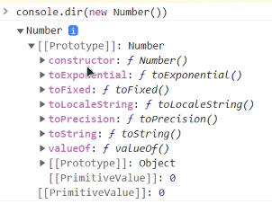

 02.02 수업 내용
chap01 - core - 10_prototype
============================
## inheritance(상속)
### 01.[[Prototype]].js
- 자바스크립트의 객체는 [[Prototype]]이라는 숨김 프로퍼티를 갖는다.
- 이 프로퍼티 값은 null이거나 다른 객체에 대한 참조가 되는데, 다른 객체를 참조하는 경우 참조 대상을 프로토타입(prototype)이라 부른다.

- object에서 프로퍼티를 읽으려 할 때 프로퍼티가 없으면, 자바스크립트는 자동으로 프로퍼티 타입에서 프로퍼티를 찾는다. 이것을 프로토타입 상속이라 한다.

- 자바스크립트는 proto 기반의 상속을 지원한다.
- 에크마 6부터 클래스에 대한 내용들이 들어오고 그 안에 필요한 정보들은 prototype(숨김프로퍼티) 형식으로 이루어져 있다.
ex) [[Prototype]] : HTMLDivElement
    객체들이 갖고있는 숨김 프로퍼티

- 생성자 함수에서 객체를 생성하고 그 안에 내부적으로 숨김 속성값으로 프로토타입을 갖고 있다. ex) 생성자함수.prototype
__proto__ 라는 속성을 통해서 객체의 안에 값을 꺼내올 수 있다.
- __proto__는 [[Prototpye]]의 getter, setter이다.
- prototype을 get,set하고 싶을 때는
  함수 Object.getPrototypeOf나 Object.setPrototypeOf를 써서 프로토타입을 get, set하는 것이 좋다.


``` javascript
const user = { // {} <- 얘를 열고 닫는 것은 객체 생성
    activate : true, //  속성
    login : function(){ // 함수
        console.log('로그인 되었습니다.');
    }
};

const student = {
    passion : true // 속성
};
// __proto__는 [[Prototpye]]의 getter, setter이다.
// 요즘에는 잘 사용하지 않지만 호환을 위해 남아있으며 직관적인 이해를 돕기 위해 여기서 사용했다.
// 함수 Object.getPrototypeOf나 Object.setPrototypeOf를 써서 프로토타입을 get, set하는 것이 좋다.
console.log("passion : " + student.passion); // 결과 : passion : true
student.__proto__ = user;
console.log(student.activate); // 결과 : true
student.login(); // 결과 : 로그인 되었습니다. 


// 즉, 39번째 줄에서의 속성 로직을 통해 student 객체의 프로토타입은 user이다. 혹은 student는 user를 상속받는다. 
// 프로토타입에서 상속받은 프로퍼티를 '상속 프로퍼티(inherited property)' 라고 한다.
```

### 프로토타입 체인
``` javascript
const greedyStudent = {
    class : 11,
    __proto__ : student, 
// greedystudent의 프로토타입은 student이고 student의 프로토타입은 user가 된다.
// 이런 것을 프로토타입 체인이라고 한다.  
// 즉, greedyStudent는 user와 student, 자기 자신의 객체 속성들을 다 가지고 있게 된다.
};

console.log(greedyStudent.activate); // user에서 상속받았다.
console.log(greedyStudent.passion); // student에서 상속받았다.

// 프로토타입 체이닝은 순환 참조가 허용되지 않는다. 무한 참조 현상이 일어난다.
```
- 프로토타입은 프로토타입을 바라보는 방향으로만 참조할 수 있다.
- 프로토타입 체이닝은 순환 참조가 허용되지 않는다. 
  순환 참조하게 되면 무한 참조 현상이 일어난다.
- __proto__의 값은 객체 또는 null만 가능하며, 다른 자료형은 무시된다.

### 02. prototype-feature.js(프로토타입 특징)
- 프로토타입은 프로퍼티를 읽을 때만 사용하며, 프로퍼티를 추가, 수정, 삭제하는 연산은 객체에 직접한다.
``` javascript
const user = {
    id: 'user',
    login: function(){
        console.log(`${this.id}님 로그인 되었습니다.`);
    }
};

const student = {
    __proto__ : user
};

// 프로토타입은 프로퍼티를 읽을 때만 사용하며 프로퍼티를 추가, 수정, 삭제하는 연산은 객체에 직접한다.
// login 메소드 내의 this는 프로토타입에 영향을 받지 않으며,
// 메서드를 객체에서 호출했던, 프로토타입에서 호출했던 상관없이
// this는 언제나 .앞에 있는 객체이다.
student.id = "user01";
student.login(); // 결과 : user01님 로그인 되었습니다.
// 메서드는 공유되지만, 객체의 상태는 공유되지 않는다.


for(let prop in student){ // student의 속성이 뭐냐
    
//     console.log(prop); // 결과 : id
//                                  login
//  그런데 상속을 받은 id인지 객체 자신의 id인지 모르기 때문에 아래 반복문에 조건을 걸어 체크를 해보는 것이다.

//  key에 대응하는 프로퍼티가 상속 프로퍼티가 아니고 obj에 직접 구현되어 있는 프로퍼티 일 때만 true를 반환한다.
    let isOwn = student.hasOwnProperty(prop);
    if(isOwn){
        console.log(`객체 자신의 프로퍼티 ${prop}`);
    } else {
        console.log(`상속 프로퍼티 ${prop}`);
    }
// 참고로 student가 Object.prototype을 상속받는 이유는
// student를 객체 리터럴 방식으로 선언했기 때문이다.

//     결과 : 객체 자신의 프로퍼티 id
//            상속 프로퍼티 login
// 즉, this가 들어가면 객체꺼의 프로퍼티 값을 이용하고,
//  그게 아니라면 상속받은 프로퍼티 값을 이용한다.
}
```

#### java와 javascript의 차이점
java 는 'class 기반' 언어라서
-> class 가 기본 '설계서' 단위고,
-> '설계서'인 class를 사용하려면 instance화(객체화)를 통해서 객체로 만들어줘야 사용 가능
-> method는 class(설계서)에 딸린 function(함수)

javascript는 'prototype 기반' 언어라서,
-> (기본적으로는) java처럼 class(설계서)가 없고,
-> 대신에 prototype을 통해서 '근본(?)'을 정하고 객체화해서 사용
-> 그 과정에서 method는 '객체 안에 프로퍼티로 정의된 함수'라는 의미

## 02.funtion-prototype
### 01_object-constructor-prototype(생성자 함수 프로토타입)
- new 연산자를 사용해 만든 객체는 생성자 함수의 프로토타입 정보를 사용해 [[Prototype]]을 설정한다.

``` javascript
const user = {
    activate : true,
    login : function(){

        console.log('로그인 되었습니다.');
    }
}

// 생성자 함수에 대한 객체를 사용할 때는 앞글자를 대문자로 구분한다.
function Student(name) {

    this.name = name;
}

// 여기서의 prototype은 앞에서 배운 프로토타입과 이름만 같을 뿐
// 실제로는 일반적인 프로퍼티이다.
Student.prototype = user;

// new를 통해서 객체를 생성할 때 생성된 객체에 새롭게 새롭게 하나씩 프로토타입을 추가해주는 작업을 해주어야 한다.
let student = new Student("홍길동");
console.log(student.activate);

// ex) F.prototype은 new F를 호출할 때만 사용 된다.
// new F를 호출할 때 만들어지는 새로운 객체의 [[Prototype]]을 할당한다.

```


### 02.function-prototype-and-constructor-property.js
- 함수의 프로토타입과 constructor 프로퍼티
- 개발자가 특별히 할당하지 않더라도 모든 함수는 기본적으로 "prototype"프로퍼티를 갖는다.
- default property의 "prototype"은 constructor 프로퍼티 하나만 있는 객체를 가리키는데,
여기서 constructor 프로퍼티는 함수 자신을 가리킨다.
즉, 함수 객체는 생성 시 자기 자신을 참조하는 prototype 속성을 가진다.

``` javascript
function Student(){} // 자기 자신에 대한 prototype는 Student다.

// Student.prototype = { constructor : Student }; // constructor라는 속성에 Student라는 객체 값을 대입하겠다.
// 위에 대입문을 쓰지 않아도 이미 자기 자신에 대한 prototype을 Student로 가지고 있기 때문에 아래 출력문이 true 값이 나오는 것이다.
console.log(Student.prototype.constructor == Student); // 결과 : true

let student = new Student(); // { constructor : Student }를 상속받은 상태
console.log(student.constructor == Student); // 결과 : true 객체일 때만([[Prototype]]을 거쳐 접근한다.)
``` 

## 03.built-in-object-prototype
### 01.object-prototype.js
- Object는 내장 객체 생성자 함수이고, 이 생성자 함수의 prototype은 
toString을 비롯한 다양한 메서드가 구현되어 있는 거대한 객체를 참조한다.
- new Object()를 호출하거나 리터럴 문법{...}을 사용해 객체를 만들 때,
새롭게 생성된 객체의 [[Prototype]]은 Object.prototype을 참조한다.
- 즉, new 연산자를 통해서 객체를 생성하나 {}로 객체를 생성하나 같은 방법이고, Object 객체를 참조한다.

``` javascript
// const obj = new Object();
const obj = {}; // 위의 const obj = new Object();와 동일한 객체 생성 구문이다.
console.log(obj.__proto__ === Object.prototype); // 결과 : true
console.log(obj.toString === obj.__proto__.toString); // 결과 : true
```

#### Prototype과 __proto__ 의 차이


### 02.built-in-object-prototye.js
#### built in object prototype의 상속구조


#### built in object prototype 내용
- Function, String, Number를 비롯한 내장 객체들 역시 프로토타입에 메서드를 저장한다.
- 모든 내장 프로토타입의 상속 트리 꼭대기엔 Object.prototype이 있어야 한다고 규정한다.
``` javascript
const num = 100; // new Number(100);

// num은 Number.prototype을 상속 받았는가 ?
console.log(num.__proto__ === Number.prototype); // true

// num은 Number를 참조받고 Number는 Object를 참조받았는가 ? 
// 즉, num은 Object.prototype을 상속 받았는가 ? 가 된다.
console.log(num.__proto__.__proto__ === Object.prototype); // true

// Object의 __proto__는 null이다. 
// 한마디로 최상위는 null이 라는 말이다.
console.log(num.__proto__.__proto__.__proto__); // 결과 : null

// Object.prototype에도 메서드 toString이 있다.
// 중복 메서드가 있을 때는 체인 상에서 가장 가까운 곳에 있는 메서드가 사용된다.
// Number.prototype이 체인 상에서 더 가깝기 때문에 아래에서는 Number.prototype의 toString이 사용된다.
console.log(num); // 결과 : 100 // [Number: 100]
console.log(num.toString()); // 결과 : 100
```

- Object.prototype에도 메서드 toString이 있다.
- 그렇게 되면 중복 메서드가 생길 수 있는데,
- 중복 메서드가 있을 때는 체인 상에서 가장 가까운 곳에 있는 메서드가 사용된다.
즉, 결국, 가장 가까운 곳이란 상속받은 친구의 메서드를 사용한다는 의미가 될 수 있다.
- 문자열과 숫자, 불린(boolean)처럼 원시 타입 값의 프로퍼티에 접근하려고 하면
    내장 생성자(String, Number, Booldean)을 사용하는 임시 래퍼(wrapper) 객체가 생성되고,
    임시 래퍼 객체는 메서드를 제공하고 난 후 사라진다.
    --> undefined와 null에 대응하는 래퍼객체는 없다.

``` javascript
// 내장 프로토타입(String)의 객체는 수정할 수 있다.
String.prototype.hello = function() {

    console.log(`hello, ${this}`);
}

"JavaScript".hello(); // 결과 : hello, JavaScript

// 내장 프로토타입의 메서드를 빌려와 새로운 메서드를 만드는 것 역시 가능하다.
const obj = {

    0: "Hello",
    1: "JavaScript",
    length: 2
}

obj.join = Array.prototype // 원래 join이라는 속성이 없는데, 이렇게 생성할 수 있다.
console.log(obj.join(", ")); // 결과 : Hello, JavaScript

// 주의점!  내장 프로토타입 변경은 되도록 하지 않아야 한다.
// 내장 프로토타입은 새로 명세서에 등록된 기능을 사용하고 싶은데, 
// 자바스크립트 엔진에 이 기능이 구현되어 있지 않을 때만 변경하는 것이 좋다.
```
- 주의점!  내장 프로토타입 변경은 되도록 하지 않아야 한다.
  내장 프로토타입은 새로 명세서에 등록된 기능을 사용하고 싶은데, 
  자바스크립트 엔진에 이 기능이 구현되어 있지 않을 때만 변경하는 것이 좋다.

## 04.modern-method
### 01.modern-method.js
- 모던 메서드 : 프로토타입 접근 시 사용하는 메서드

``` javascript
const user = {
    activate : true
}

// Object.create(proto) : [[Prototype]]이 proto를 참조하는 빈 객체를 만든다.
// 프로토타입이 user인 student 라는 빈 객체를 새로 생성
const student = Object.create(user);
console.log('student.activate : ' + student.activate); // 결과 : student.activate : true

// student의 프로퍼티 타입이 user인가 ?
// Object.getPrototypeOf(obj) - obj의 [[Prototype]]을 반환
console.log(Object.getPrototypeOf(student) === user); // 결과 : true

// student 객체 타입을 {}로 바꾸겠다.
// Object.setPrototpyeOf(obj, proto) - obj의 [[Prototype]]이 proto가 되도록 설정
Object.setPrototypeOf(student, {});
console.log(Object.getPrototypeOf(student) === user); // 결과 : false

// __proto__를 getter, setter로 직접 사용할 수 있다.
// 또한, 직접 사용할 수 있기 때문에 키가 "__proto__" 일 때 에러가 발생하는 의도하지 않는 결과가 나올 수 있다.
const obj = {};

let key = "__proto__";
obj[key] = "값 설정"; 
console.log(obj[key]); // 값 설정이 아닌 [Object: null prototype] 이 출력
obj[key] = {test : '새로운 객체 덮어쓰기'};
console.log(obj[key]); // { test: '새로운 객체 덮어쓰기' } <- 덮어씌워지면 안되는데 덮어씌워지는 문제가 발생한다.
```

#### 브라우저에서 Prototype 확인하기



#### 참고 자료
https://medium.com/@bluesh55/javascript-prototype-%EC%9D%B4%ED%95%B4%ED%95%98%EA%B8%B0-f8e67c286b67
