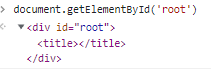

# 컴포넌트
- 재사용의 사용 단위

## 클래스형 컴포넌트
- ES6에서 제공되는 클래스 문법을 이용해서 렌더링 될 컴포넌트를 정의하는 방법을 제공한다.
- render() 함수는 반드시 작성되어야 하며, 반환값으로는 렌더링 될 리액트 엘리먼트를 정의한다.
  (일반적으로 JSX를 사용한다.)
- JSX만으로도 리액트 엘리먼트를 정의할 수 있지만,
  클래스형으로 컴포넌트를 작성하게 되면 여러가지 장점이 있다.
- 그 중 한가지는 재사용이 가능하다는 점이다.
- 중복되는 엘리먼트들을 추상화해서 컴포넌트로 작성하고, 
  작성된 컴포넌트를 재사용 하는 것이 리액트가 추구하는 한 가지 방향이다.
``` javascript
class Title extends React.Component {

    render() { // 리턴할 땐 반드시 리액트 엘리먼트를 정의한다.
        return <h1>Class Component</h1>
    }
}
ReactDOM.createRoot(document.getElementById('root')).render(<Title />);
// 클래스에 들어있는 컴포넌트를 사용하겠다고 요소에 < 클래스 />로 넣어준다.
```
- 클래스에 들어있는 컴포넌트를 사용하려면 
  render 함수 안에 render(<클래스 />)형식으로 엘리먼트로 넣어준다.

### 클래스형 컴포넌트를 정의하는 방법
- 컴포넌트를 정의하는 방법은 현재 두 가지 방식을 제공한다.
- 클래스형 컴포넌트와 함수형 컴포넌트이다.
- 사용하는 것은 함수형 컴포넌트가 더 간결하고 선언하기도 편하며,
  메모리도 덜 사용하기에 더 권장되는 방식이다.

- 하지만 유상태 컴포넌트(status) 사용 및 라이프사이클 기능,
  임의의 메소드 정의 등은 클래스형 컴포넌트에서만 사용 가능하다.
- 이러한 함수형 컴포넌트의 기능적 한계로 훅스(hooks)를 제공하고 있다.

## 함수형 컴포넌트 
``` javascript
function Title() { // 사용자 정의 엘리먼트

    return <h1>Function Component</h1>;
}

ReactDOM.createRoot(document.getElementById('root')).render(<Title />);
// render(element) 안에 element에 사용자 정의 엘리먼트를 소문자로 넣으면 태그로 넣어준다.
```


### 함수형 컴포넌트 작성시 유의사항
- 함수형 컴포넌트 작성 시 유의사항은 대문자로 정의해야 한다는 것이다.
- 사용자 정의 엘리먼트를 이용할 시 <Title />이런 형식으로 사용하게 되는데, 
  앞글자가 소문자이면 html태그로 인식하게 되고, 
존재하지 않는 html 태그 엘리먼트 이기 때문에 에러가 발생하게 된다.
``` javascript
function title() { // 사용자 정의 엘리먼트

    return <h1>Function Component</h1>;
}

ReactDOM.createRoot(document.getElementById('root')).render(<title />);
// render(element) 안에 element에 사용자 정의 엘리먼트를 소문자로 넣으면 태그로 넣어준다.
```


### 함수형 컴포넌트의 단점
- 함수형 컴포넌트의 단점은 state와 라이프사이클 API 사용이 불가능하다는 것이었는데,
  v16.8부터 hooks를 제공하여 이 문제를 해결하였다.

## 컴포넌트 합성
- 컴포넌트는 자신의 출력에 다른 컴포넌트를 참조할 수 있다.
- 컴포넌트는 재사용 가능한 크기로 작게 유지해야 하며,
  순수 함수처럼 작성되어야 한다.
- 각 컴포넌트 별로 스타일을 지정해 줄 수도 있고, 합칠 수 도 있다. 
``` javascript
function NameCard(){

    return <h1>{user.name}</h1>
}

function AgeCard(){

    return <h2 style={{ color: "orangered" }}>{user.age}</h2>
}

function PhoneCard(){

    return <h3 style={{ color: "yellow" }}>{user.phone}</h3>
}

function EmailCard(){

    return <h3 style={{ color: "red" }}>{user.email}</h3>
}

function UserInfo() {

    return( 
            <div style={{width: 300, border: "1px solid black"}}>
                <NameCard />
                <AgeCard />
                <EmailCard />
            </div>
    );
}

ReactDOM.createRoot(document.getElementById('root')).render(<UserInfo />);
```