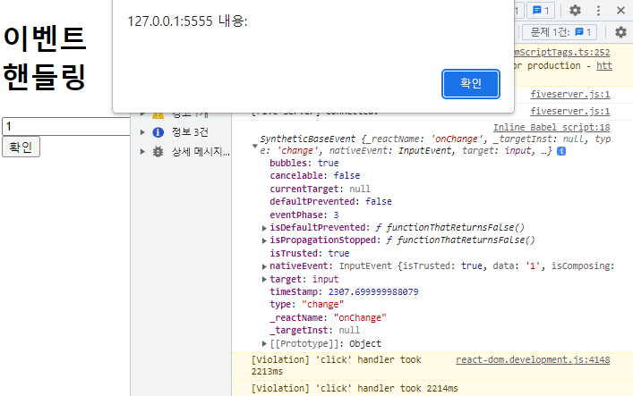

# React의 이벤트
- 리액트 이벤트 시스템은 웹 브라우저의 HTML 이벤트와 인터페이스가 동일하기 때문에 사용 방법이 거의 유사하다.

## 이벤트 주의사항
1. 이벤트 속성의 이름은 카멜 표기법으로 작성해야한다.(onclick -> onClick)

2. 이벤트에 실행할 자바스크립트의 코드를 전달하는 것이 아닌, 함수 형태의 값을 전달한다.
##### HTML 기준 예시
``` javascript
<button onclick="alert('hello world')">클릭</button>
```
##### React 기준 예시
``` javascript
<button onClick={() => alert('hello world')}>클릭</button>
```

3. DOM 요소에만 이벤트를 설정할 수 있다.
   (사용하려는 컴포넌트에 이벤트를 자체적으로 설정할 수는 없다.)
##### 예시
``` javascript
<App onClick={() => alert('hello world!')}>
// 컴포넌트 자체에 이벤트를 주는게 아닌 App이라는 컴포넌트의 onClick 속성에 함수를 넣어준 것이다.
```

## 이벤트 예제

### 1. 직접 이벤트 속성에 함수 이벤트 동작 확인

``` javascript
class EventButton extends React.Component {
    constructor(props) {
        super(props); // 생성자를 만들고 props를 사용할 때는 props를 부모쪽으로 전송을 꼭 해줘야 한다.
    }
    render() {
        console.log(this.props);
        return <button onClick={() => alert('인라인 함수 이벤트 동작 확인')}>{this.props.children}</button>
    }
    ReactDOM.createRoot(document.getElementById('root')).render(
        <EventButton>이벤트</EventButton>
    );
```

### 2. render 함수 외부에 이벤트 함수 정의 후 함수를 전달하여 이벤트 연결
``` javascript
class EventButton extends React.Component {
    constructor(props) {
        super(props); // 생성자를 만들고 props를 사용할 때는 props를 부모쪽으로 전송을 꼭 해줘야 한다.
    }
    onClickHandler = () => {
        alert('외부 함수 이벤트 동작 확인');
    };

    render() {

        return <button onClick={this.onClickHandler}>{this.props.children}</button>;
    }
    ReactDOM.createRoot(document.getElementById('root')).render(
        <EventButton>이벤트</EventButton>
    );
```

### 3. component에 이벤트 전달 후 연결
``` javascript
class EventButton extends React.Component {
    constructor(props) {
        super(props); // 생성자를 만들고 props를 사용할 때는 props를 부모쪽으로 전송을 꼭 해줘야 한다.
    }

    render() {
        console.log(this.props);

        const { onClick, children } = this.props;

        return <button onClick={onClick}>{children}</button>;
    }
}

ReactDOM.createRoot(document.getElementById('root')).render(
    // <EventButton>이벤트</EventButton>
    <EventButton onClick={() => alert('props로 이벤트 전달 후 연결 확인')}>이벤트 버튼</EventButton>
);
```

# 이벤트 핸들링
``` javascript
class EventComponent extends React.Component {

    state = {
        message: "",
    };

    render() {

        return (
            <>
                <h1>이벤트 핸들링</h1>
                <input // 리액트에서 단일 태그들도 무조건 닫아줘야 한다.
                    type="text"
                    name="message"
                    placeholder="텍스트를 입력해주세요."
                    onChange={(e) => {
                            console.log(e.target.value); // e.target에 있는 값이 필요하다.

                            this.setState({
                                message: e.target.value,
                            });
                        }
                    }
                    value={this.state.message} // 초기화
                /> 
                <button
                    onClick={
                        () => {alert(this.state.message);
                    }}    
                >
                    확인                        
                </button>
            </>
        );
    }
}

ReactDOM.createRoot(document.getElementById('root')).render(<EventComponent />);
```

<hr>

## 이벤트 핸들링 this
- 함수가 호출될 때 this는 호출부에 따라 결정되게 된다.
- 클래스가 임의 메서드가 특정 HTML요소의 이벤트로 등록되는 과정에서 메소드와 this의 관계가 끊어져버린다.
- 이 때문에 임의의 메소드가 이벤트로 등록되어도 this가 컴포넌트 자신을 제대로 가리키기 위해서는
  메소드를 this와 바인딩하는 작업이 필요하다.
- 만약, 바인딩하지 않으면 this는 undefined가 된다.
``` javascript
class EventComponent extends React.Component {

    state = {
        message: "",
    };

    constructor(props){
        super(props);

        this.onChangeHandler = this.onChangeHandler.bind(this); // 외부의 this와 이 함수 안의 this와 연결시켜준다.
        // 아래 render의 this를 끌고와서 constructor의 연결을 시켜줬다 라고 생각하자.
        this.onClickHandelr = this.onClickHandelr.bind(this);
    }
    
    onChangeHandler(e) { // 인자에 e를 넣으면 모든 이벤트를 캐치한다.
        this.setState({
            message: e.target.value
        });
    }

    onClickHandelr(e) {
        alert(this.state.message);

        this.setState({
            message: ""
        });
    }
    render() {

        return (
            <>
                <h1>이벤트 핸들링</h1>
                <input // 리액트에서 단일 태그들도 무조건 닫아줘야 한다.
                    type="text"
                    name="message"
                    placeholder="텍스트를 입력해주세요."
                    onChange={this.onChangeHandler}
                    value={this.state.message} // 초기화
                /> 
                <button
                    onClick={this.onClickHandelr}    
                >
                    확인                        
                </button>
            </>
        );
    }
}

    ReactDOM.createRoot(document.getElementById('root')).render(<EventComponent />);
```

## 이벤트 핸들링 this문제 해결
- 기존 이벤트 핸들링에서 this바인딩을 해주지 않으면, 각자 바라보는 this가 다르기 때문에 오류가 발생했는데,
- 화살표 함수 형태로 메소드를 정의하게 되면 자동 바인드 처리가 된다.
``` javascript
class EventComponent extends React.Component {

    state = {
        message: "",
    };

    constructor(props){
        super(props);
    }
 
    onChangeHandler = (e) => { // 함수에 대한 표현식을 화살표 함수로만 바꿔주었다.
    // 그럼 바인디이 자동으로 일어난다.
        this.setState({
            message: e.target.value
        });
    }

    onClickHandelr = (e) => {
        alert(this.state.message);

        this.setState({
            message: ""
        });
    }
    render() {

        return (
            <>
                <h1>이벤트 핸들링</h1>
                <input // 리액트에서 단일 태그들도 무조건 닫아줘야 한다.
                    type="text"
                    name="message"
                    placeholder="텍스트를 입력해주세요."
                    onChange={this.onChangeHandler}
                    value={this.state.message} // 초기화
                /> 
                <button
                    onClick={this.onClickHandelr}    
                >
                    확인                        
                </button>
            </>
        );
    }
}

ReactDOM.createRoot(document.getElementById('root')).render(<EventComponent />);
```

## 다중 이벤트 핸들링
``` javascript
class LoginComponent extends React.Component {

    state = {
        username: "",
        password: "",
    };

    onChangeUsernameHandler = (e) => { // 아이디에 대한 값이 입력되면 업데이트하기 위해 만든 함수
        // e라는 인자값을 준 이유는 어느 요소에 대한 타겟이 누군지 알고있어야 해서 e를 주었다.
        // 버튼을 클릭했다 라는 정보를 가지고 오기 위해 !!
        console.log(e.target.value);
        this.setState({
            username: e.target.value,
            password: this.state.password
        });
    }

    onChangePasswordHandler = (e) => { // 비밀번호에 대한 값이 입력되면 업데이트하기 위해 만든 함수
        console.log(e.target.value);
        this.setState({
            username: this.state.username,
            password: e.target.value
        });
    }

    onClickLoginButtonHandler = () => {
        
        alert(`username : ${this.state.username}\npassword : ${this.state.password}`);
        this.setState({
            username: "",
            password: "",
        });
    }

    render() {

        return (
            <div>
                <h1>로그인</h1>
                <label>아이디 : </label>
                <input type="text" name="username" placeholder="아이디를 입력하세요" value={this.state.username} onChange={this.onChangeUsernameHandler} />
                <br />
                <label>비밀번호 : </label>
                <input type="password" name="password" placeholder="비밀번호를 입력하세요" value={this.state.password} onChange={this.onChangePasswordHandler} />
                <br />
                <button onClick={this.onClickLoginButtonHandler}>로그인</button>
            </div>
        );
    }
}

ReactDOM.createRoot(document.getElementById('root')).render(<LoginComponent />);
```
### 다중 이벤트 핸들링 타겟지정

- 만약 5개의 리스트에서 각각 버튼이 있고, 버튼을 클릭하려고 하는데 몇번 째의 버튼인지 알아야 하니까 이벤트를 사용한 타겟을 알아야 하기 때문에 e를 인자로 넣어주는 것이다.


## 다중 이벤트 핸들링 상태 값 쉽게 추가
- 값이 추가될 때마다 매번 상태 값들을 추가해줘야 하기 때문에 불편하다. 그래서 이렇게 사용한다
``` javascript
onChangeHandler = (e) => {

        this.setState({
            ...this.state, // 스프레드 문법을 사용하여 this.state에 대한 기존의 내용들을 깊은 복사해서 새로운 객체를 만든다.
            // {"username":"123", "password":"123"}이라는 객체를 새로 만들어 내용이 동일하면 그대로 들고 변경점이 있으면 변경점 있는 부분만 덮어써준다.
            [e.target.name]: e.target.value, // 객체 안에 [값]는 key이다. 
            // 대괄호를 여는 이유는 칸을 띄우거나 특수문자를 다이렉트를 받아줄 수 없기 때문에 사용하려면 대괄호로 묶어서 사용해야 한다.
            // 즉, 특수문자를 사용하기 위해서(e.target.name) <- .이 특수문자
            
        });
    }
    
    onClickHandler = (e) => {

        alert(`username : ${this.state.username}\npassword : ${this.state.password}`);
        this.setState({
            username: "",
            password: "",
        });
    }
```
- input태그의 name 속성을 들고와서 값을 바꿔주는데,


### 이벤트 쉽게 이해하기
``` javascript
    this.setState({
            message: e.target.value
            // 실시간 입력값 value로 뽑아내서 state.message에 동기화 
            (value -> state.message)
    });
    }}
    value={this.state.message}
        // button클릭 시 메시지박스를 초기화 하기위한 value와 state.message값 동기화 
    //  (value -> state.message -> value) 이제 내가바뀌면 너도바뀌고, 너가바뀌면 나도바뀌는 상황이 됨.
/>
<button
    onClick={()=> {
    alert(this.state.message);
    this.setState({
            message: ""
    //위에서 동기화된 값을 초기화 -> 버튼클릭시 동기화된 state.message가 value를 초기화
    });
```

### concat()
- 콘캣함수는 원래 가지고 있던 주소로 합치는게 아닌
- 합쳐서 새로운 주소를 가진 아이로 만드는것이다.

## 함수형 컴포넌트 이벤트 핸들링
- 클래스와는 다르게 state가 없기 때문에 this를 쓰지 않는다.
``` javascript
const { useState } = React;

function LoginComponent() {

    const [username, setUsername] = useState(""); // username의 상태값 관리를 위함. useState는 초기값 설정
    const [password, setPassword] = useState("");

    const onChangeUsername = (e) => setUsername(e.target.value);
    const onChangePassword = (e) => setPassword(e.target.value);
    const onClickHandler = () => {
        
        alert(`username : ${username}\npassword : ${password}`);
        setUsername("");
        setPassword("");
    };

    return (
        <div>
            <h1>로그인</h1>
            <label>아이디 : </label>
            <input 
                type="text" 
                name="username" 
                placeholder="아이디를 입력하세요"
                value={username} 
                onChange={onChangeUsername} 
            />
            <br />
            <label>비밀번호 : </label>
            <input 
                type="password" 
                name="password" 
                placeholder="비밀번호를 입력하세요" 
                value={password} 
                onChange={onChangePassword} 
            />
            <br />
            <button onClick={onClickHandler}>로그인</button>
        </div>
    );
}

ReactDOM.createRoot(document.getElementById('root')).render(<LoginComponent />);
```

## 다중 함수형 컴포넌트 이벤트 핸들링
``` javascript
const { useState } = React;

function LoginComponent() {

const { useState } = React;

    function LoginComponent() {

        const [form, setForm] = useState({ // form이라는 상태값 안에 username과 password를 같이 관리하겠다.
            username: "",
            password: "",
            });

        const { username, password } = form; 
        // 비구조화 할당을 통해 username과 password를 개별적으로 사용할 수 있다. 기존 form.username 이렇게 쓴걸 개별적으로 변경 ~

        const onChangeHandler = (e) => {
            
            const changeForm = { // 불변성 맞춰주기
                ...form,
                [e.target.name]: e.target.value, 
            };
            
            setForm(changeForm);
        };

        const onClickHandler = () => {
            alert(`username : ${username}\npassword: ${password}`);

            setForm({
                username: "",
                password: "",
            });
        };

        const onKeyPressHandler = (e) => {

            console.log(e);
            // if(e.charCode === 13) { 각 키 별로 고유한 번호가 있다.
            if(e.key === "Enter"){
                onClickHandler();
            }
        }

    return (
        <div>
            <h1>로그인</h1>
            <label>아이디 : </label>
            <input 
                type="text" 
                name="username" 
                placeholder="아이디를 입력하세요"
                value={username} 
                onChange={onChangeHandler} 
            />
            <br />
            <label>비밀번호 : </label>
            <input 
                type="password" 
                name="password" 
                placeholder="비밀번호를 입력하세요" 
                value={password} 
                onChange={onChangeHandler} 
                onKeyPress={onKeyPressHandler} // 엔터쳤을때 발생하는 이벤트
            />
            <br />
            <button onClick={onClickHandler}>로그인</button>
        </div>
    );
    
    }
    ReactDOM.createRoot(document.getElementById('root')).render(<LoginComponent />);
```

