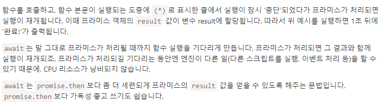

# fetch-async-await
- 자바스크립트를 사용하면 필요할 때 서버에 네트워크 요청을 보내고 새로운 정보를 받아올 수 있다.
- AJAX를 이용해서 페이지 새로 고침 없이 서버에서 비동기적으로 데이터를 가져올 수 있다.
- AJAX외에도 서버에 네트워크 요청을 보내고 받아올 수 있는 방법 중 fetch api를 이용할 수 있다.
- fetch는 구식 브라우저에서는 지원하지 않지만 대부분의 모던 브라우저가 이를 지원하고 있다.
- 요청에 대한 내용들을 보내고 요청을 확인하려면 서버가 필요한데, 서버에 대한 내용을 대신해서 보여주는 fetch-api 테스트할 수 있다.
- https://jsonplaceholder.typicode.com/ <- 해당 사이트에서 가능하다.

``` javascript
 /* 자바스크립트를 사용하면 필요할 때 서버에 네트워크 요청을 보내고 새로운 정보를 받아올 수 있다. 

    AJAX를 이용해서 페이지 새로 고침 없이 서버에서 비동기적으로 데이터를 가져올 수 있다.

    AJAX외에도 서버에 네트워크 요청을 보내고 받아올 수 있는 방법 중 fetch api를 이용할 수 있다.
    fetch는 구식 브라우저에서는 지원하지 않지만 대부분의 모던 브라우저가 이를 지원하고 있다.

    기본 사용 방법
    let promise = fetch(url, [options])

    url: 접근하고자 하는 url
    options: 선택 매개변수로 method나 header등을 지정할 수 있다.

    options에 아무 값도 넣지 않으면 기본 GET 메소드로 요청을 하게된다.

    fetch를 호출하면 브라우저는 네트워크 요청을 보내고 promise를 반환한다.
*/

/* api 불러오기 */
async function callAPI() {

    /* fetch api를 그냥 호출하면 promise를 반환 */
    const promise = fetch('http://jsonplaceholder.typicode.com/users');
    console.log(promise);
    // 프로미스 객체에 대한 내용들 반환

    /* 해당 내용에 직접 접근하지 못한다. */
    console.log('[[PromiseResult]]'); // 직접 접근이 불가능해서 출력으로 줬다.

    /* await를 이용하여 호출하면 응답객체 반환 */
    const response = await fetch('http://jsonplaceholder.typicode.com/users');
    console.table(response);

    console.log(`응답 상태 : ${response.status}`);
    for(let [key, value] of response.headers){
        console.log(`${key} : ${value}`);
    }

    console.log(`본문 내용 사용 여부 : ${response.bodyUsed}`);
    // 사용하지 않았으니 false반환

    /* response body를 문자열 형태로 반환 */
    // const responseText = await response.text(); // 본문 내용을 사용했다.
    // // 한번이라도 꺼내 사용하면 재사용이 불가능하다. 그래서 아래 구문에서 에러 발생하는 것이다.
    // console.log(responseText);

    /* response body를 json 형태로 반환 */
    const json = await response.json();
    console.log(json); // 문자열에 대한 내용들이 이미 읽어져서 에러 발생
    // 스트림을 이용하여 응답을 1회 받고 난 후에는 더 이상 스트림을 이용할 수 없다.
    // 즉, 한번 꺼내면 재사용이 불가능하다.
    console.log(`본문 내용 사용 여부 : ${response.bodyUsed}`);
    // 
}

function App() {

    const onClickHandler = () => {

        callAPI();
    }

    return <button onClick={onClickHandler}>API 요청</button>
}

ReactDOM.createRoot(document.getElementById('root')).render(<App />);
```

## fetch 기본 사용 방법
- let promise = fetch(url, [options])

- url: 접근하고자 하는 url
- options: 선택 매개변수로 method나 header등을 지정할 수 있다.

-  options에 아무 값도 넣지 않으면 기본 GET 메소드로 요청을 하게된다.

## async 사용의 장점


---

# fetch-then을 이용해 더 간결한 비동기 처리

``` javascript
function callAPI() {

    // fetch('http://jsonplaceholder.typicode.com/users')
    //     .then(response => response.json())  // 요청을 보내서 응답을 받아 json문자열을 받고
    //     .then(data => console.log(data)); // 데이터에 대한 내용들을 출력해라

    fetch('https://jsonplaceholder.typicode.com/posts', { // 기존 비동기 요청을 보내는 방식을 이런식으로 사용이 가능하다.
        method: 'post',
        body: JSON.stringify({ // 만들어진 문자열을 json 형태로 변환
            title:'foo',
            body:'bar',
            userId:1
        }),
        headers: {
            'Content-type':'application/json; charset=UTF-8'
        }
    })
    .then((response) => response.json())
    .then((data) => console.log(data));
}


function App() {

    const onClickHandler = () => {

        callAPI();
    }

    return <button onClick={onClickHandler}>API 요청</button>
}

ReactDOM.createRoot(document.getElementById('root')).render(<App />);
```

# axios 비동기 처리
- 기존 fetch나 axios를 이용하나 차이가 없다.
- fetch보다는 코드가 간결하다.

``` javascript
function callAPI() {

    axios.get('https://jsonplaceholder.typicode.com/users')
        .then(res => console.log(res))
        .catch(err => console.log(err)); 
}

function App() {

    const onClickHandler = () => {

        callAPI();
    }

    return <button onClick={onClickHandler}>API 요청</button>
}

ReactDOM.createRoot(document.getElementById('root')).render(<App />);
```

## axios를 이용한 github 이미지 주소 가져오기
``` javascript
const { useState } = React;

function SearchBox({ setImgUrl }) {

    const [imojiName, setImojiName] = useState('');

    const onClickHandler = () => {

        axios.get('https://api.github.com/emojis')
            .then(res => {
                console.log(res.data[imojiName]);
                setImgUrl(res.data[imojiName]);
            })
    }

    return (
        <>
            <input type="search" name="imojiName" value={imojiName} onChange={e => setImojiName(e.target.value)} />
            <button onClick={onClickHandler}>검색</button>
        </>
    );
} 

function ImageBox({ imgUrl }) {

    return (
        imgUrl?  : null
    );
} 

function App() {

    const [imgUrl, setImgUrl] = useState('');

    return (
        <>
            <SearchBox setImgUrl={ setImgUrl } />
            <br />
            <ImageBox imgUrl={ imgUrl } />
        </>
    );
}

ReactDOM.createRoot(document.getElementById('root')).render(<App />);
```

# data component
``` javascript
const { useState, useEffect } = React;

function Item({ user }){

    const onClickHandler = (id) => {
        console.log(id);
    }

    return (
        <div className="item" onClick={ () => onClickHandler(user.id) }>
            <h4>{user.name} ({user.username})</h4>
            <p>
                userId : {user.id}<br />
                email : {user.email}<br />
                phone : {user.phone}<br />
            </p>
        </div>
    );
}

function ItemList() {
    // 배열 형식으로 들어오기 때문에 빈 배열
    const [users, setUsers] = useState([]);

    useEffect(() => {

        fetch('https://jsonplaceholder.typicode.com/users')
            .then(response => response.json())
            .then(responseUsers => setUsers(responseUsers));
    });
    
    return (
        <div>
            { users.map(user => <Item user={user} key={ user.id } />) }
        </div>
    );
}

function Title() {
    return <h1>회원 목록 </h1>;
}

function App() {

    return (
        <>
            <Title />
            <ItemList />
        </>
    );
}

ReactDOM.createRoot(document.getElementById('root')).render(<App />);
```

# 날짜 정보 가져오기

``` javascript

```