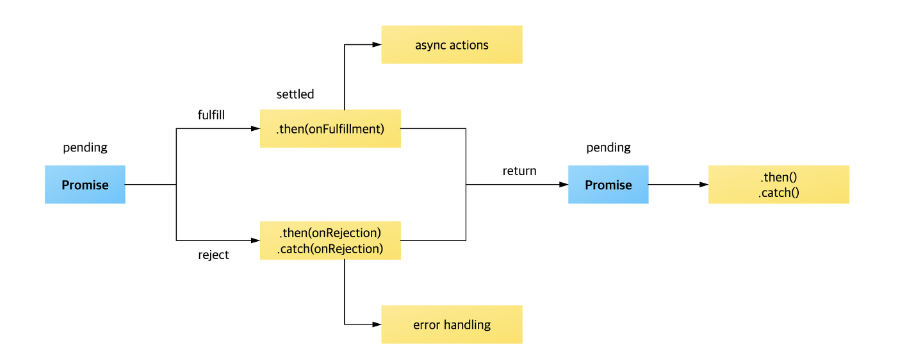
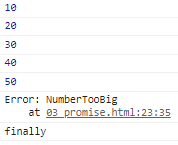

# 콜백함수 지옥
- 계속 추가적으로 로직을 만들어야 했던 문제가 있다.
- 참고사이트
- https://chiefcoder.tistory.com/14



---
``` javascript
/* 1초 뒤에 첫 번째 인자의 값을 10 증가시켜주는 함수, 두번째 인자의 콜백함수의 매개변수로 결과를 넘겨준다. */
function increase(number, callback) {

    setTimeout(
        () => {
            const result = number +  10;

            if(callback){
                callback(result); // 위의 인자에 result의 값 넘겨준다.
            }
        }, 1000);
}

increase(0, result => console.log(result)); // 위에서 계산된 10을 콘솔의 result에 넣어줘서 콘솔에 10이 출력

/* 여러 번 순차적으로 1초마다 10씩 증가하게 하고싶다면 ? */
console.log("start...");

increase(0, (result) => {
    console.log(result);
    increase(result, result => {
        console.log(result);
        increase(result, result => {
            console.log(result);
            increase(result, result => {
                console.log(result);
                increase(result, result => {
                    console.log(result);
                });
            });
        });
    });
});
```

# 콜백함수 지옥을 해결하는 promise
- promise는 콜백지옥같은 코드가 형성되지 않게 하는 방안으로 ES6에서 도입되었다.
- promise에서 resolve함수로 전달한 값은 then으로 전달하는 콜백함수의 매개변수를 이용해서 받아올 수 있다
- promise에서 resolve는 성공, reject는 실패를 의미한다.
- 실패 시 결과값을 reject로 전달
- reject의 에러 캐치는 .catch 메서드를 이용한다.

``` javascript
/* promose는 콜백지옥같은 코드가 형성되지 않게 하는 방안으로 ES6에서 도입되었다. */
function increase(number) {

    /* promise에서 resolve는 성공, reject는 실패를 의미 */
    const promise = new Promise((resolve, reject) => {
        setTimeout(() => {
            const result = number + 10;

            if(result > 50) {
                const e = new Error("NumberTooBig");

                /* 실패 시 결과값을 reject로 전달 */
                return reject(e);
            }

            resolve(result);
        }, 1000);
    });

    return promise;
}

/* promise에서 resolve함수로 전달한 값은 then으로 전달하는 콜백함수의 매개변수를 이용해서 받아올 수 있다. */
increase(0)
    .then((number) => {
        console.log(number);

        return increase(number);
    })
    .then((number) => {
        console.log(number);

        return increase(number);
    })
    .then((number) => {
        console.log(number);

        return increase(number);
    })
    .then((number) => {
        console.log(number);

        return increase(number);
    })
    .then((number) => {
        console.log(number);

        return increase(number);
    })
    .catch((e) => {
        /* 에러가 발생하는 것을 catch에서 잡는다. */
        console.log(e);
    })
    .finally(() => {
        console.log("finally");
    });
```
## 결과

---

# 비동기 처리를 일괄적으로 실행하는 async
- 함수의 선언부에 async 키워드를 이용하고, 함수 내부에서 promise를 사용할 때 await 키워드를 이용한다.
- await 키워드가 붙은 promise 호출구문은 promise 작업이 끝날때까지 기다리며 실행하게 된다.

``` javascript
function increase(number) {

    const promise = new Promise((resolve, reject) => {
        setTimeout(() => {
            const result = number + 10;

            if(result > 50) {
                const e = new Error("NumberTooBig");

                return reject(e);
            }

            resolve(result);
        }, 1000);
    });
    return promise;
}

/* 함수의 선언부에 async 키워드를 이용하고, 함수 내부에서 promise를 사용할 때 await 키워드를 이용한다.
    await 키워드가 붙은 promise 호출구문은 promise 작업이 끝날때까지 기다리며 실행하게 된다.
*/
async function run() {

    try{
        
        let result = await increase(0);
        console.log(result);

        result = await increase(result);
        console.log(result);

        result = await increase(result);
        console.log(result);

        result = await increase(result);
        console.log(result);

        result = await increase(result);
        console.log(result);

        result = await increase(result);
        console.log(result);

    } catch(e) {
        console.log(e);
    }
}

run();
```
## 결과


--- 