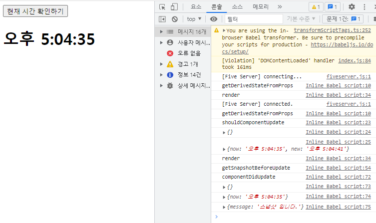
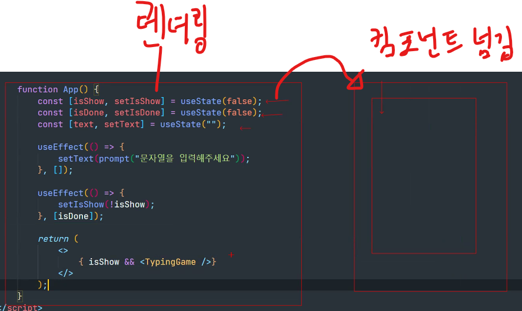

# hooks란 ?
- Hooks는 리액트 16.8에서 새로 도입된 기능으로, 함수 컴포넌트에서 사용 불가능한 생명주기 메소드의 한계점으로 인해
  상태관리 및 렌더링 이후 시점 컨트롤 등 다양한 문제를 해결하기 위해 만든 함수 집합을 의미한다.

## useState ? 
- 그 중 useState는 가장 기본적인 hook이며, 함수 컴포넌트에서도 상태를 관리할 수 있게 해준다.
  
## useEffect ?
- 컴포넌트가 렌더링 된 이후에 특정 작업을 수행할 필요가 있다면, 
  클래스형 컴포넌트에서는 componentDidMount 혹은 componentDidUpdate 메소드를 이용하면 된다.
- 하지만 함수형 컴포넌트에서는 생명주기 api 사용이 불가능하다.
- 그렇기에 함수형 컴포넌트에서도 렌더링 된 이후 시점에 수행할 내용이 필요한 경우
  사용할 수 있는 기능을 hook으로 제공하고 있다.
- 그것이 useEffect이다.

### useEffect의 동작 흐름
``` javascript  
    console.log(React);

    const { useEffect } = React;

    function MessagePrinter(props) {
        console.log("렌더링");

        useEffect(() => {
            console.log("렌더링 이후 동작..");
        });

        return (
            <h1>
                {console.log("렌더링 시 출력")}
                {props.message}
            </h1>
        );
    }
    const message = "안녕하세요";

    ReactDOM.createRoot(document.getElementById('root')).render(<MessagePrinter message={message} />);
```
- 웹 화면

---

### useEffect를 이용한 mount
- useEffect는 기본적으로 마운트 된 시점과 업데이트 된 시점 두 가지 모두 동작하게 된다.
- 마운트 될 때만 동작하고, 업데이트 시에는 동작하지 않게도 컨트롤 할 수 있다.
- 의존성 배열을 주입하여 []를 두번 째 인자로 추가해주면, 최초에 마운트 될 때만 실행이 가능하고
- []안에 상태값 변수를 넣어주고 변수의 상태가 바뀌면 실행할거야 라는 조건을 걸 수도 있다.
- 즉, 시점에 따라 설정할 수 있다.
``` javascript
const { useState, useEffect } = React;

function TimePrinter() {
    const [time, setTime] = useState(new Date().toLocaleTimeString());

    useEffect(() => {
        console.log("렌더링 직후 마운트가 직전에만 동작함....");
    }, 
    [time] // 의존성 배열 []로 두번째 인자를 추가해주면, 최초에 마운트 될 때만 실행하게 된다.
        // 빈 배열을 사용하면, 첫 마운트로만 사용하고 싶다고 할때 도 사용이 가능하고.
        // []안에 변수를 넣어서 해당 변수의 상태가 바뀌면 실행할거야라고 조건을 걸 수 도 있다.

    );

    return (
        <>
            <button onClick={() => setTime(new Date().toLocaleTimeString())}>
                현재 시간 확인하기     
            </button>
            <h1>{time}</h1>
        </>
    );
}

ReactDOM.createRoot(document.getElementById('root')).render(<TimePrinter />);
```

### useEffect update 구문
``` javascript
const { useState, useEffect } = React;
    
function LoginForm() {

    const [user, setUser] = useState({ // 초기값 설정
        username: "",
        password: "",
    });

    console.log(user);

    const onChangeHandler = (e) => {
        
        setUser({
            ...user, // 스프레드 문법으로 user의 대한 값을 새로 객체로 복제
            [e.target.name] : e.target.value // 불변성 유지
        });
    }

    useEffect(() => { // name과 password에 대한 내용을 별도로 표현하고 싶다고 변경할 수 있다.
        console.log("username update....");
    }, [user.username]);

    useEffect(() => { // 이 구문은 username이 변경돼도 찍히지 않는다.
        console.log("password update....");
    }, [user.password]); // 동작하기 전 변경 전 값과 변경 후 값을 비교하여 일치하면 호출을 건너뛴다.
                                 // 즉, 변경이 없으면 동작하지 않는다.

    return (
        <>
            <label>username : </label>
            <input type="text" name="username" onChange={onChangeHandler} />
            <br />
            <label>password : </label>
            <input type="text" name="password" onChange={onChangeHandler} />
            <br />
            <h3>username : {user.username}</h3>
            <h3>password : {user.password}</h3>
        </>
    );
}

ReactDOM.createRoot(document.getElementById('root')).render(<LoginForm />);
```

### useEffect cleanup
- 메모리 누수 및 충돌의 가능성을 배제시키기 위해 한다.
```javascript
/* 
useEffect는 기본적으로 렌더링 직후와 업데이트 직후 호출된다.

클래스 컴포넌트의 경우 componentWillUnmount에서 하는 역할과 동일하다.
                                        누수 및 충돌 가능성
렌더링 ==========> 마운트  ========> 상태변경 =========> 언마운트 =======> 렌더링 ========> 마운트
        effect                               cleanup                            effect
*/    
const { useState, useEffect } = React;

function Counter() {
    const [count, setCount] = useState(0);

    useEffect(() => {
        console.log("useEffect.....");

        return () => {
            console.log("clean-up");
        };
    });

    return (
        <>
            <h1>count : {count}</h1>
            <button onClick={() => setCount(count + 1)}>+ 1</button>
            <button onClick={() => setCount(count - 1)}>- 1</button>
        </>
    );
}


ReactDOM.createRoot(document.getElementById('root')).render(<Counter />);
```

### useEffect-cleanup example
``` javascript
const { useState, useEffect } = React;
        
function Timer() {

    useEffect(() => {
        console.log("타이머가 시작합니다...");

        const timer = setInterval(() => {
            console.log(new Date().toLocaleTimeString());
        }, 1000);

        /* 해당 컴포넌트를 언마운트 시 setInterval을 종료 */
        return () => {
            clearInterval(timer);
            console.log("타이머가 종료됩니다.");
        }
    }, []);

    return <h1>타이머를시작합니다.</h1>
}

function App() { // 상태값에 따른 토글 
    const [isTrue, setIsTrue] = useState(false);

    return (
        <>
            <button onClick={() => setIsTrue(!isTrue)}>타이머 토글</button>
            {isTrue && <Timer />}
        </>
    );
}

ReactDOM.createRoot(document.getElementById('root')).render(<App />);
```

### useEffect 사용한 예제
``` javascript
const { useState, useEffect } = React;

function TypingGame({ text, isDone, setIsDone }) {
    const [input, setInput ] = useState('');

    const onKeyPressHandler = (e) => {

        if(e.key == 'Enter') { 
            if(text === input) {
                setIsDone(!isDone); // false였으니까 부정으로 주면 true가 된다.
            }
        }
    };

    useEffect(() => {
            const start = new Date().getTime();

            return () => {
                const end = new Date().getTime();

                const interval = end - start;

                alert(`${ interval }(ms)`);
            }
        }, []);

    return (
        <>
            <h1>{ text }</h1>
            <input 
                type="text"
                onChange={ (e) => setInput(e.target.value)} // 입력된 값
                onKeyPress = {onKeyPressHandler} // 핸들러 매핑
                value={input} // 사용자가 입력한 값
            />
        </>
    );
}

function App() {
    const [isShow, setIsShow] = useState(false);
    const [isDone, setIsDone] = useState(false);
    const [text, setText] = useState("");

    useEffect(() => {
        setText(prompt('문자열을 입력해주세요'));
    }, []); // 마운트 할때만 동작하게 만들 것이다.

    useEffect(() => {
        setIsShow(!isShow);
    }, [isDone]);

    return (
        <>
            { isShow && <TypingGame text={ text } isDone={ isDone } setIsDone={ setIsDone } />};
        </>
    );
}

ReactDOM.createRoot(document.getElementById('root')).render(<App />);
```

