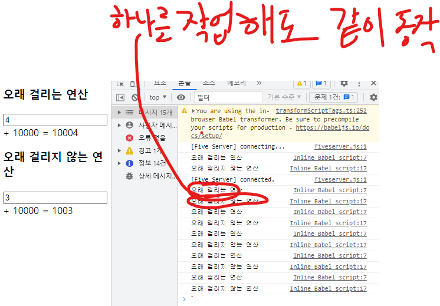

# useMemo 란?
- 값 상태에 대한 내용을 관리해주기 위함
- 성능을 우선시해주기 위해 만들어진 hook

## useMemo를 사용하지 않은 예제
``` javascript
const { useState } = React;

const longtimeCalculator = (number) => {

    console.log('오래 걸리는 연산');
    for(let i = 0; i < 99999999; i++) {

    }

    return number + 10000;
};

function App() {

    const [longtimeNumber, setLongtimeNumber] = useState(1);
    const longtimeResult = longtimeCalculator(longtimeNumber);

    return (
        <>
            <h3>오래 걸리는 연산</h3>
            <input 
                type="number" 
                value={longtimeNumber} 
                onChange={(e) => setLongtimeNumber(parseInt(e.target.value))} 
            />
            <span> + 10000 = {longtimeResult}</span>
        </>
    );
}

ReactDOM.createRoot(document.getElementById('root')).render(<App />);
```
- 연산이 오래걸릴 수록 로딩이 느려진다.

## useMemo를 사용하지 않으면 렌더링 호출에서 문제가 생기는걸 확인
``` javascript
const { useState } = React;

const longtimeCalculator = (number) => {

    console.log('오래 걸리는 연산');
    for(let i = 0; i < 99999999; i++) {

    }

    return number + 10000;
};

const shorttimeCalculator = (number) => {

    console.log('오래 걸리지 않는 연산');

    return number + 1000;
    };

function App() {

    const [longtimeNumber, setLongtimeNumber] = useState(1);
    const [shorttimeNumber, setShorttimeNumber] = useState(1);
    const longtimeResult = longtimeCalculator(longtimeNumber);
    const shorttimeResult = shorttimeCalculator(shorttimeNumber);

    return (
        <>
            <h3>오래 걸리는 연산</h3>
            <input 
                type="number" 
                value={longtimeNumber} 
                onChange={(e) => setLongtimeNumber(parseInt(e.target.value))} 
            />
            <span> + 10000 = {longtimeResult}</span>
            <h3>오래 걸리지 않는 연산</h3>
            <input 
                type="number" 
                value={shorttimeNumber} 
                onChange={(e) => setShorttimeNumber(parseInt(e.target.value))} 
            />
            <span> + 10000 = {shorttimeResult}</span>
        </>
    );
}

ReactDOM.createRoot(document.getElementById('root')).render(<App />);
```
### 값 확인

---

## useMemo를 이용한 문제 해결 예제
- 간단한 작업을 할 때 시간이 오래 걸리는 작업까지 함께 수행하기에는 너무 비효율적이기 때문에
  어려운 연산을 통해 나온 값을 메모리상에 저장해두고, 그 값이 변경되지 않을 때는 다시 렌더링 되지 않도록 한다.
- 연산으로 얻은 값 자체를 메모라이즈 하기 위해서 사용되는 hooks가 useMemo이다.
``` javascript
const { useState, useMemo } = React;

const longtimeCalculator = (number) => {

    console.log("오래 걸리는 연산");
    for (let i = 0; i < 999999999; i++) {

    }
    return number + 10000;
};

const shorttimeCalculator = (number) => {
    console.log("오래 걸리지 않는 연산");

    return number + 10000;
}

function App() {

    /*
        간단한 작업을 할 때 시간이 오래 걸리는 작업까지 함께 수행하기에는 너무 비효율적이기 때문에
        어려운 연산을 통해 나온 값을 메모리상에 저장해두고, 그 값이 변경되지 않을 때는 다시 렌더링 되지 않도록 한다.
        연산으로 얻은 값 자체를 메모라이즈 하기 위해서 사용되는 hooks가 useMemo이다.
    */
    const [longtimeNumber, setLongtimeNumber] = useState(1);
    const [shorttimeNumber, setShorttimeNumber] = useState(1);

    /* 첫번째 콜백함수는 연산을 수행한 후 반환받는 값을 콜백함수의 리턴값 형태로 작성
        두번째 인자는 의존성 배열을 이용해서 등록한 값의 변화를 감지한다.
    */
    const longtimeResult = useMemo(() => {

        return longtimeCalculator(longtimeNumber);
    }, [longtimeNumber]);

    const shorttimeResult = useMemo(() => {
        return shorttimeCalculator(shorttimeNumber);
    }, [shorttimeNumber]);

    return (
        <>
            <h3>오래 걸리는 연산</h3>
            <input
                type="nubmer"
                value={longtimeNumber}
                onChange={e => setLongtimeNumber(parseInt(e.target.value))}
            />
            <span> + 10000 = {longtimeResult} </span>
            <h3>오래 걸리지 않는 연산</h3>
            <input
                type="number"
                value={shorttimeNumber}
                onChange={(e) => setShorttimeNumber(parseInt(e.target.value))}
            // 뭘 바꾸든 랜더링이 일어나서  둘 다 다시그려야해서 다시 실행된다..
            />
            <span> + 10000 = {shorttimeResult} </span>
        </>
    )
}

ReactDOM.createRoot(document.getElementById('root')).render(<App />);
```
### 결과

---

## Object type의 에러 발생 예제 및 해결
``` javascript
const {useState, useEffect, useMemo} = React;

function App() {
    
    const[number, setNumber] = useState(0);
    const[isKorea, setIsKorea] = useState(true);

    // const location = isKorea? "한국" : "외국"; // 원시타입이어서 값의 변경이 이루어지지 않아 괜찮다.

    // const location = { // 상태값에 대한 내용은 그대로 있지만 지역변수는 새로운 요청이 들어오면 주소값이 달라진다.
    //     country: isKorea? "한국" : "외국"
    // }; // 이러한 문제를 useMemo를 통해 해결한다.

    const location = useMemo(() => {
        return {
            country: isKorea? "한국" : "외국",
        };
    }, [isKorea]); // isKorea의 상태 값이 변경될 때 useEffect 호출된다.
        
    useEffect(() => {
        console.log('useEffect 호출됨...');
    }, [location]); // location이 변경될 때만 실행
    
    return (
        <>
            <h2>좋아하는 숫자를 입력해주세요.</h2>
            <input type="number" value={number} onChange={(e) => setNumber(e.target.value)} />
            <hr />
            <h2>지금 당신이 있는 위치는?</h2>
            <p>국가 : { location.country }</p>
            <button onClick={() => setIsKorea(!isKorea)}>국가 토글 하기</button>
        </>
    );
}

ReactDOM.createRoot(document.getElementById('root')).render(<App />);
```