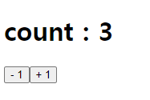
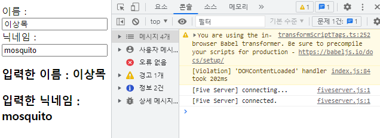

# reducer
- 성능 향상이나 유지보수를 용이하게 하려고 사용하는 hook이다.
- 반복적인 state 상태관리에 대한 내용들을 외부 한 곳에 놓고 관리하려는 용도로 보통 사용한다.
- useReducer는 다양한 컴포넌트의 state를 업데이트 할 때 사용하는 Hook이다.
- Reducer는 새로운 상태를 만들 때 반드시 불변성을 지켜주어야 한다.
(기존 state의 값 변경을 하지말고 새로 만들 것)

## reducer를 사용한 +1, -1 카운트 예제
``` javascript
 /* 
    useReducer는 다양한 컴포넌트의 state를 업데이트 할 때 사용하는 Hook이다.
    Reducer는 새로운 상태를 만들 때 반드시 불변성을 지켜주어야 한다.
    (기존 state의 값 변경을 하지말고 새로 만들 것)        

    사용하는 가장 큰 이유는
    컴포넌트 업데이트 로직을 컴포넌트 밖으로 분리할 수 있다.(외부에 컴포넌트를 보낼 수 있다.)
    즉, 컴포넌트 내부의 상태값 관리 로직이 반복적으로 일어나는 내용이면 따로 빼서 참조해서 사용한다.
    ex) 폼 태그의 반복되는 내용을 여러곳에서 사용할 수 있다.
*/

const { useReducer } = React;

// reducer 함수의 첫번 째 인자는 기존 상태값, 두번째 인자는 업데이트를 위해 필요한 정보를 담은 객체
function reducer(state, action) { // 아래 dispatch에 대한 내용을 여기서 호출한다.

    switch(action.type){ 
    // Counter에서 버튼이 클릭되면 dispatch가 reducer를 호출해서 여기서 가지고 있는 타입으로 state의 값을 꺼내와 리턴해주는 방식이다. 

        case "INCREMENT":
            return { value: state.value + 1};
        case "DECREMENT":
            return { value: state.value - 1};
        default:
            return state; // 아무것도 건들지 않을 땐 state를 한다.
    }
}

function Counter() {
    // useReducer 함수의 첫 번째 인자는 reducer 함수, 두번 째 인자는 해당 리듀서의 기본값을 넣어준다.
    // state는 현재 상태이고, dispatcher는 액션을 발생시키는 함수
    const [state, dispatch] = useReducer(reducer, {value : 0}); // 상태값을 관리하는 코드

    return (
        <>
            <h1>count : { state.value }</h1>
            <button onClick={() => dispatch({ type: "DECREMENT"})}>- 1</button>
            <button onClick={() => dispatch({ type: "INCREMENT"})}>+ 1</button>
        </>
    );
}

ReactDOM.createRoot(document.getElementById('root')).render(<Counter />);
```
### 결과

---

## reducer를 사용해 06_event-multipel-function 업그레이드 시키기
``` javascript
const { useReducer } = React;

function reducer(state, action) {
    // state는 기존 상태값, action은 input 태그의 name과 value를 담는다.

    return {
        ...state,
        [action.name]: action.value
    }
}

function RegistForm() {

    const [state, dispatch] = useReducer(reducer, {
        name: "",
        nickname: ""
    });

    const { name, nickname } = state;

    /* change 이벤트가 발생하면 reducer로 이벤트 발생 객체를 전달 */
    const onChangeHandler = (e) => { dispatch(e.target); }

    return (
        <>
            <label>이름 : </label>
            <input type="text" name="name" value={name} onChange={onChangeHandler} />
            <br />
            <label>닉네임 : </label>
            <input type="text" name="nickname" value={nickname} onChange={onChangeHandler}/>
            <br />
            <div>
                <h3>입력한 이름 : {name} </h3>
                <h3>입력한 닉네임 : {nickname} </h3>
            </div>
        </>
    );
}

ReactDOM.createRoot(document.getElementById('root')).render(<RegistForm />);
```
### 결과

---