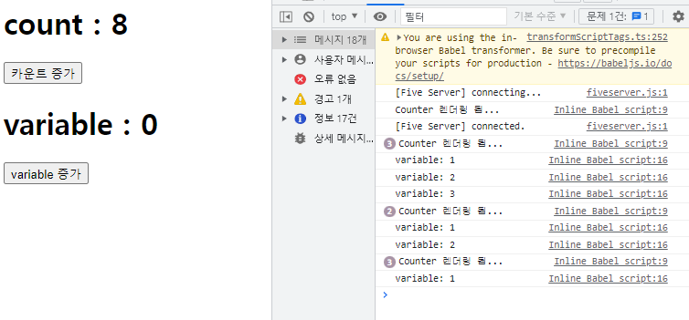
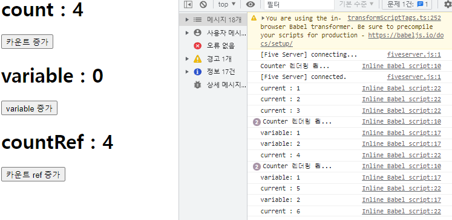

# 리렌더링 문제
- 사용자가 볼 때는 정상적으로 카운트가 잘 올라가는 것 처럼 보이지만
- 내부적으론 불필요하게 초기화가 되어 여러 개의 값을 혼합해서 사용하지 못한다.
``` javascript
const { useState } = React;

function Counter() {

    const [count, setCount] = useState(0);
    let variable = 0;

    console.log("Counter 렌더링 됨...");
    const increaseCount = () => {
        setCount(count + 1);
    };

    const increaseVariable = () => {
        variable += 1;
        console.log(`variable: ${variable}`);
    }

    return (
        <>
            <h1>count : {count}</h1>
            <button onClick={increaseCount}>카운트 증가</button>
            <h1>variable : {variable}</h1>
            <button onClick={increaseVariable}>variable 증가</button>
        </>
    );
}

ReactDOM.createRoot(document.getElementById('root')).render(<Counter />);
```
결과 : 


---

## useRef를 사용한 해결
``` javascript
const { useState, useRef } = React;

function Counter() {

    const [count, setCount] = useState(0);
    let variable = 0;
    const countRef = useRef(0);

    console.log("Counter 렌더링 됨...");
    const increaseCount = () => {
        setCount(count + 1);
    };

    const increaseVariable = () => {
        variable += 1;
        console.log(`variable: ${variable}`);
    }

    const increaseCountRef = () => {
        countRef.current = countRef.current + 1; // current = 현재 가지고 있는 상태값을 참조할 수 있는 속성
        console.log(`current : ${countRef.current}`);
    }

    return (
        <>
            <h1>count : {count}</h1>
            <button onClick={increaseCount}>카운트 증가</button>
            <h1>variable : {variable}</h1>
            <button onClick={increaseVariable}>variable 증가</button>
            <h1>countRef : {countRef.current}</h1>
            <button onClick={increaseCountRef}>카운트 ref 증가</button>
        </>
    );
}

ReactDOM.createRoot(document.getElementById('root')).render(<Counter />);
```
- variable은 카운트 증가를 클릭 시 초기화가 되지만,
- useRef를 사용한 countRef는 초기화가 되어도 기존 값을 계속 사용한다.

---

# inputref
``` javascript
const { useState, useRef, useEffect } = React;

function LoginComponent() {

    const [form, setForm] = useState({
        username: '',
        password: ''
    });

    /* 렌더링 이전에 동작하기 때문에 최초에는 undefined가 출력된다. */
    const usernameRef = useRef();
    console.log(usernameRef);

    useEffect(() => {
        console.log(usernameRef);

        usernameRef.current.focus();
    }, []);   
    
    const onChangeHandler = (e) => {

        setForm({
            ...form,
            [e.target.name]: e.target.value
        });
    }

    const onClickHandler = () => {

        alert(`username : ${ form.username}\npassword ${ form.password}`);
        setForm({
            username: "",
            password: ""
        });

        usernameRef.current.focus();
    }


    return (
        <>
            <input 
                type="text"
                name="username"
                ref={usernameRef}
                placeholder="username"
                value={ form.username }
                onChange= {onChangeHandler}
            />
            <br />
            <input 
                type="text"
                name="password"
                placeholder="password"
                value={form.password}
                onChange={onChangeHandler}    
            />
            <button onClick={onClickHandler}>로그인</button>
        </>
    );
}


ReactDOM.createRoot(document.getElementById('root')).render(<LoginComponent />);
```