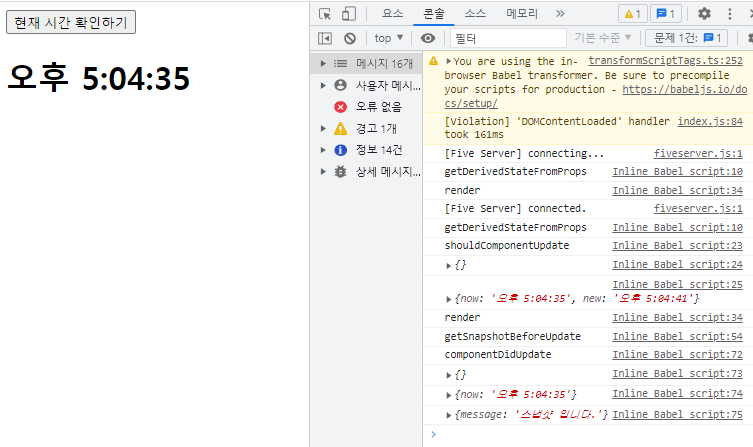

# 컴포넌트 라이프 사이클
- 컴포넌트 라이프 사이클 메소드는 총 9가지가 있따.
- 라이프사이클은 총 3가지 카테고리가 있다.
- 마운트, 업데이트, 언마운트로 나뉜다.

## 마운트
- DOM이 생성되고 웹 브라우저 상 나타나는 것을 마운트(Mount)라고 한다.

## 업데이트
- 컴포넌트의 상태가 바뀌는 경우를 의미하며, 총 4가지의 업데이트 상황이 있다.
- props변경, state변경, 부모 컴포넌트 리렌더링, this.forceUpdate로 강제로 렌더링 트리거

## 언마운트
- 컴포넌트를 DOM에서 제거하는 것을 언마운트(UnMount)라고 한다.

## 마운트 순서
- 마운트 시 constructor -> getDerivedStateFromProps -> render -> componentDidMount 순으로 호출된다.

- https://ko.reactjs.org/docs/react-component.html 참고하기

### 1. 컴포넌트를 새로 만들 때마다 호출되는 클래스 생성자 메서드
``` javascript
constructor(props) {
    super(props);
    console.log(props);
    console.log("constructor");

    /* 생성자 내에서는 state를 초기화 한다. */
    this.state = {
        text: "",
    };
}
```

### 2. props에 있는 값을 state에 넣을 때 사용하는 메서드
``` javascript
static getDerivedStateFromProps(nextProps, prevState){ // props값, state값
    /* props로 받아온 값을 state에 동기화 시키는 용도로 사용  
        */
    console.log("getDerivedStateFromProps");
    console.log(nextProps);
    console.log(prevState);
    
    if(nextProps.text !== prevState.text) { // 둘이 다르면 밑에 리턴구문 실행

        return {text : nextProps.text}; // 넘겨받은 text를 받아서 text에 넣어주는 형식(state에 상태값 변경이 필요한 경우)
    }

    return null; // state에 변경할 필요가 없다면 null을 반환하겠다.
}
```

### 3. 리액트 엘리먼트를 랜더트리 형태로 구성하는 시점에 호출되는 메서드 */
- render() : 클래스형 컴포넌트에 꼭 있어야만 하는 유일한 메서드다.
- render 메소드는 this.props와 this.state에 접근할 수 있다. 
- 아무런 컴포넌트도 보여주고 싶지 않다면, null 혹은 falsy 값을 반환하도록 한다.

#### 주의사항
- 이 메소드 내에서는 이벤트 설정이 아닌 곳에서 setState를 사용하면 안된다. 

- 사진처럼 업데이트가 계속 이루어진다.
- 또한, 브라우저의 DOM에 접근해서도 안된다.
- DOM정보를 가지고 오거나, state에 변화를 줄 때 componentDidMount에서 처리해야 한다.

``` javascript
render() {

    console.log("render");
    return <h1>Hello, World, {this.state.text} !</h1>
}
```

### 4. 컴포넌트가 웹 브라우저 상에 나타난 후 호출하는 메소드
- 컴포넌트를 다 만든 후에 첫 렌더링을 마치고 나면 호출된다.
- 다른 자바스크립트 라이브러리 또는 프레임워크의 함수를 호출하거나,
  이벤트 등록, setTimeout, setInterval, 네트워크 요청 같은 "비동기 작업"을 처리하면 된다.
- 즉, 비동기 처리를 여기서 하면 된다.
``` javascript
componentDidMount() {
               
    console.log("componentDidMount");
}
```

### 한 코드로
``` javascript
class Greeting extends React.Component {

    /* 1. 컴포넌트를 새로 만들 때마다 호출되는 클래스 생성자 메소드 */
    constructor(props) {
        super(props);
        console.log(props);
        console.log("constructor");

        /* 생성자 내에서는 state를 초기화 한다. */
        this.state = {
            text: "",
        };
    }

    /* 2. props에 있는 값을 state에 넣을 때 사용하는 메서드이다. */
    static getDerivedStateFromProps(nextProps, prevState){ // props값, state값
        /* props로 받아온 값을 state에 동기화 시키는 용도로 사용  
            */
        console.log("getDerivedStateFromProps");
        console.log(nextProps);
        console.log(prevState);
        
        if(nextProps.text !== prevState.text) { // 둘이 다르면 밑에 리턴구문 실행

            return {text : nextProps.text}; // 넘겨받은 text를 받아서 text에 넣어주는 형식(state에 상태값 변경이 필요한 경우)
        }

        return null; // state에 변경할 필요가 없다면 null을 반환하겠다.
    }
    /* 3. 리액트 엘리먼트를 랜더트리 형태로 구성하는 시점에 호출되는 메서드 */
    render() {

        /* render 메소드는 this.props와 this.state에 접근할 수 있다. 
            아무런 컴포넌트도 보여주고 싶지 않다면, null 혹은 falsy 값을 반환하도록 한다.
        */
        /* 
            이 메소드 내에서는 이벤트 설정이 아닌 곳에서 setState를 사용하면 안된다. 
            또한, 브라우저의 DOM에 접근해서도 안된다.
            DOM정보를 가지고 오거나, state에 변화를 줄 때 componentDidMount에서 처리해야 한다.
        */
        console.log("render");
        return <h1>Hello, World, {this.state.text} !</h1>
    }

    /* 4. 컴포넌트가 웹 브라우저 상에 나타난 후 호출하는 메소드 */
    componentDidMount() {
        /*  컴포넌트를 다 만든 후에 첫 렌더링을 마치고 나면 호출된다. 

            다른 자바스크립트 라이브러리 또는 프레임워크의 함수를 호출하거나,
            이벤트 등록, setTimeout, setInterval, 네트워크 요청 같은 "비동기 작업"을 처리하면 된다.
            */
        console.log("componentDidMount");
    }
}
ReactDOM.createRoot(document.getElementById('root')).render(<Greeting text="홍길동" />);
```
#### 웹 상 결과


## 업데이트
- 컴포너트 업데이트 생명주기에 대한 업데이트 기준은 크게 4가지로 나뉜다.
1. props 변경
2. state 변경
3. 부모 컴포넌트 리렌더링
4. this.forceUpdate로 강제 렌더링 트리거(render 내에서는 가급적 사용하지 않아야 핟나. 사실상 쓸 일은 거의 없다.)

1. getDerivedStateFromProps(props가 변경되는 시점)
2. -> shouldComponentUpdate(props, state가 변경되는 시점)
3. -> render(모든 업데이트 시 동작 -> this.forceUpdater)
4. -> getSnapshotBeforeUpdate5.
5. -> componentDidUpdate

### 코드

#### 1. props에 있는 값을 state에 넣을 때 사용하는 메서드
``` javascript
static getDerivedStateFromProps(nextProps, prevState){
    console.log("getDerivedStateFromProps");

    return null;
}
```

#### 2. 컴포넌트가 리렌더링을 할 것인지 말 것인지를 결정하는 메서드
- 자주 사용되지 않는 생명주기 메소드이며,
  주로 성능 최적화를 목적으로 하여 상황에 따라 리렌더링을 방지할 목적으로 사용한다. 
- 특정 state일 경우에만 업데이트를 해줄때 사용한다.
- 반드시 boolean을 반환해야 하며, false를 반환할 시 업데이트 과정은 여기서 중단된다.
- 해당 메서드를 만들지 않으면, 언제나 true값을 반환한다.
``` javascript
shouldComponentUpdate(nextProps, nextState) {

    /* 자주 사용되지 않는 생명주기 메소드이며,
        주로 성능 최적화를 목적으로 하여 상황에 따라 리렌더링을 방지할 목적으로 사용한다. 
        특정 state일 경우에만 업데이트를 해줄때 사용한다. 
    */
    console.log('shouldComponentUpdate');
    console.log(nextProps);
    console.log(nextState);

    // 반드시 boolean을 반환해야 하며, false를 반환할 시 업데이트 과정은 여기서 중단된다.
    // 해당 메서드를 만들지 않으면, 언제나 true값을 반환한다.
    return true; // 렌더링 한다.
    // return false; // 리렌더링 안한다
}
```

- 왼쪽이 렌더링 한거고 오른쪽은 렌더링 안됐다.

#### 3. 컴포넌트를 렌더링 하는 메소드
``` javascript
render() {
    console.log("render");

    return (
        <>
        <button onClick={() => this.setState({ new : new Date().toLocaleTimeString() })}>
            현재 시간 확인하기    
        </button>
        <h1>{this.state.now}</h1>
        </>
    );
}
```

#### 4. 컴포넌트의 변화를 실제 DOM에 반영하기 직전에 호출하는 메소드
- 목적 자체는 반영되기 직전에 변화를 주고싶다거나,
  다음 컴포넌티드 업데이트 쪽으로 전달해서 비동기 처리로 요청해 재사용 하기 위한 정제 목적이다.
- render에서 만들어진 결과물이 브라우저에 실제 반영되기 직전에 호출되며,
  해당 메소드의 반환값은 componentDidUpdate에서 전달받을 수 있다.
- 주로 업데이트 하기 직전의 값을 참고할 일이 있을 때 활용한다.(스크롤바 위치 유지 등)
``` javascript
getSnapshotBeforeUpdate(prevProps, prevState) {
    /* 
        render에서 만들어진 결과물이 브라우저에 실제 반영되기 직전에 호출되며,
        해당 메소드의 반환값은 componentDidUpdate에서 전달받을 수 있다.

        -> 주로 업데이트 하기 직전의 값을 참고할 일이 있을 때 활용한다.(스크롤바 위치 유지 등)
    */
    console.log("getSnapshotBeforeUpdate");

    //    return null; // 스냅샷으로 줄 게 없으면 null

    return {
        message: "스냅샷 입니다.",
    };
}

componentDidUpdate(prevProps, prevState, snapshot) {
    /* 
        리렌더링을 완료한 후 실행
        업데이트가 끝난 직후이기 떄문에 DOM관련 처리를 해도 되며,
        컴포넌트가 이전에 가졌던 데이터 prevProps, prevState로 접근할 수 있다.

        또한, getSnapshotBeforeUpdate에서 반환하는 값을 세번째 파라미터인 snapshot으로 전달받을 수 있다.
    */
    console.log("componentDidUpdate");
    console.log(prevProps);
    console.log(prevState);
    console.log(snapshot);
}
```
- 리렌더링을 완료한 후 실행
- 업데이트가 끝난 직후이기 떄문에 DOM관련 처리를 해도 되며,
  컴포넌트가 이전에 가졌던 데이터 prevProps, prevState로 접근할 수 있다.
- 또한, getSnapshotBeforeUpdate에서 반환하는 값을 세번째 파라미터인 snapshot으로 전달받을 수 있다.

#### 전체 코드
``` javascript
class TimePrinter extends React.Component {

    state = {
        now: new Date().toLocaleTimeString(),
    };

    /*  1. props에 있는 값을 state에 넣을 때 사용하는 메서드 */
    static getDerivedStateFromProps(nextProps, prevState){
        console.log("getDerivedStateFromProps");

        return null;
    }

    /* 2. 컴포넌트가 리렌더링을 할 것인지 말 것인지를 결정하는 메서드 */
    shouldComponentUpdate(nextProps, nextState) {

        /* 자주 사용되지 않는 생명주기 메소드이며,
        주로 성능 최적화를 목적으로 하여 상황에 따라 리렌더링을 방지할 목적으로 사용한다. 
        
        특정 state일 경우에만 업데이트를 해줄때 사용한다.
        */
        console.log('shouldComponentUpdate');
        console.log(nextProps);
        console.log(nextState);

        // 반드시 boolean을 반환해야 하며, false를 반환할 시 업데이트 과정은 여기서 중단된다.
        // 해당 메서드를 만들지 않으면, 언제나 true값을 반환한다.
        return true;
    }

    /* 3. 컴포넌트를 렌더링 하는 메소드 */
    render() {
        console.log("render");

        return (
            <>
            <button onClick={() => this.setState({ new : new Date().toLocaleTimeString() })}>
                현재 시간 확인하기    
            </button>
            <h1>{this.state.now}</h1>
            </>
        );
    }

    /* 4. 컴포넌트의 변화를 실제 DOM에 반영하기 직전에 호출하는 메소드 */
    getSnapshotBeforeUpdate(prevProps, prevState) {
        /* 
            render에서 만들어진 결과물이 브라우저에 실제 반영되기 직전에 호출되며,
            해당 메소드의 반환값은 componentDidUpdate에서 전달받을 수 있다.

            -> 주로 업데이트 하기 직전의 값을 참고할 일이 있을 때 활용한다.(스크롤바 위치 유지 등)
        */
        console.log("getSnapshotBeforeUpdate");

    //    return null; // 스냅샷으로 줄 게 없으면 null

        return {
            message: "스냅샷 입니다.",
        };
    }

    componentDidUpdate(prevProps, prevState, snapshot) {

        /* 
            리렌더링을 완료한 후 실행
            업데이트가 끝난 직후이기 떄문에 DOM관련 처리를 해도 되며,
            컴포넌트가 이전에 가졌던 데이터 prevProps, prevState로 접근할 수 있다.

            또한, getSnapshotBeforeUpdate에서 반환하는 값을 세번째 파라미터인 snapshot으로 전달받을 수 있다.
        */
        console.log("componentDidUpdate");
        console.log(prevProps);
        console.log(prevState);
        console.log(snapshot);
    }

}

ReactDOM.createRoot(document.getElementById('root')).render(<TimePrinter />);
```
##### 결과


## 언마운트 카테고리의 생명주기
- 언마운트 시 componentWillUnmount가 호출한다.
- DOM을 삭제하면 그 때 호출된다.
``` javascript
class Greeting extends React.Component {
    render() {
        console.log("render");
        return <h1>Hello World</h1>;
    }

    /* 1. 컴포넌트가 웹 브라우저 상에서 사라지기 직전에 호출하는 메소드 */
    componentWillUnmount() {
        console.log('componentWillUnmount');
    }
}

const root ReactDOM.createRoot(document.getElementById('root')).render(<Greeting />);

setTimeout(() => {
    root.render(document.getElementById('root')).render(null);
}, 5000); // 5초뒤에 위에 렌더링 그렸던 것들을 지우겠다.
```

## 오류 처리에 관한 함수 사용
- 
``` javascript
class ErrorBoundary extends React.Component {
    state = {
        hasError : false,
    };

    /* 1. 자손 컴포넌트에서 오류가 발생했을 때 호출 */
    static getDerivedStateFromError(error){
        console.log('getDerivedStaticFromError');
        /*
            해당 메서드는 매개변수로 오류를 전달받고, 갱신된 state값을 반드시 반환해야한다.
            주의할 점은 render()단계에서 호출되기 때문에 부수적인 효과를 여기서 발생시키면 안된다.
        */
        return { hasError : true }
    }

    componentDidCatch(error, info){

        /*
            error - 발생한 오류
            info - 어떤 컴포넌트가 오류를 발생시켰는지에 대한 정보를 포함한 객체
            /->오류 로그 등
            
            오류 로그들을 기록하는 특정 메소드를 호출한다는 작업등을 이부분에서 추가해서 사용할 수 있다.

            이부분에서도 setState()를 호출해서 상태를 변경해서 에러페이지를 랜더리링할 수 있기는 한데
            이방법은 향후 버전에서 사용할 수 없게 될거라 위의 getDerivedStateFromError메소드에서
            변경될 state를 반환하여 UI를 핸들링하는 것이 좋다. 
        */
        console.log("componentDidCatch");
        console.log(error, info);
    }

    render(){
        if(this.state.hasError){
            return <h1>에러가 발생했습니다.</h1>;
        }
        console.log(this.props); 
        return this.props.children;
    }
}

class TimePrinter extends React.Component {

    state = {
        now : new Date().toLocaleTimeString(),
    };

    render(){
        return (
            <>
                <button onClick={() => this.setState({ now : new Date().toLocaleTimeString() })}>
                    현재 시간 확인하기
                </button>
                <h1>{this.state.now}</h1>
            </>
        );
    }
} 

class App extends React.Component{
    render(){
        return (
            <>
                <ErrorBoundary>
                    <TimePrinter />
                </ErrorBoundary>
            </>
        );
    }
}

ReactDOM.createRoot(document.getElementById('root')).render(<App />);
```

