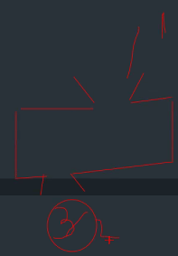
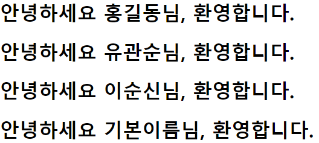
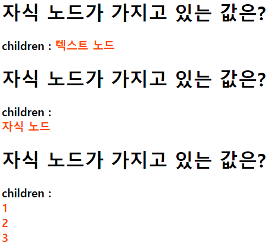
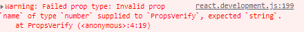

# Props
- properties의 약어로,
  컴포넌트의 속성을 설정할 때 사용하는 요소이다.
- props값은 해당 컴포넌트를 사용하는 부모 컴포넌트에서 설정할 수 있다.
- 어떤 특정한 값을 상위에서 하위로 전달해서 내려간다.
- 즉, 상위 계층껄 받아서 컨트롤해서 쓸거다.
- props는 읽기 전용이기 때문에 수정해서는 안된다.

### 리액트에서의 엄격한 규칙
- 리액트는 매우 유연하게 사용하지만 한가지 엄격한 규칙이 있다.
- "모든 React 컴포넌트는 자신의 props를 다룰 때 반드시 순수 함수처럼 동작해야 한다."
- 동일한 입력값에 대해 동일한 결과를 반환하는 것을 순수함수라고 하며
  컴포넌트는 이러한 순수 함수처럼 작성되어야 한다.

ex) 1을 넣었을 때 3이 나오라고 설정해놓았는데 2가 나와서는 안된다.

<hr>

### props의 다양한 사용법
``` javascript
const name1 = "홍길동";
const name2 = "유관순";

function Title(props) { // props에 대해 사용할 때는 함수 파라미터에 props를 넣어준다.
    console.log(props);
    console.log(props.name);
    // 아래 구문은 그냥 변수를 자바스크립트 문법으로 선언한 것이지 props가 아니다.
    return <h1>안녕하세요 {props.name}님, 환영합니다.</h1>
}

/* props.name이 존재하지 않는 경우 기본 값 설정 */
Title.defaultProps = {
    name: "기본이름",
};

ReactDOM.createRoot(document.getElementById('root')).render([
    <Title name={name1}/>,
    // 변수로 담아서 사용이 가능하다.
    <Title name={name2}/>,
    <Title name="이순신" />,
    // 문자열로도 사용이 가능하다.
    <Title />
    // 위에 기본값 설정(defaultProps)하여 디폴트로 사용할 수 있다.
]);
```

<hr>

## props.children
- 자식 노드를 전달하는 props.children
- 리액트 컴포넌트를 사용할 때 태그 사이의 내용을 props의 children 속성에서 관리한다.
``` javascript
function ChildrenPrinter(props) {
    console.log(props)
    return (
        <>
            <h1>자식 노드가 가지고 있는 값은?</h1>
            <h3>
                children : <font style={{ color: "orangered" }}>{props.children}</font>    
                { /* 아래 <ChildrenPrinter태그 사이에 들어있는 텍스트 노드라는 요소와 자식노드를 불러온다. */}
            </h3>

        </>
    );
}

ReactDOM.createRoot(document.getElementById('root')).render([
    <ChildrenPrinter>텍스트 노드</ChildrenPrinter>,
    <ChildrenPrinter><div>자식 노드</div></ChildrenPrinter>,
    <ChildrenPrinter> // 자식이 3개이기 때문에 배열로 관리한다.
        <div>1</div>
        <div>2</div>
        <div>3</div>
    </ChildrenPrinter>

]);
```

<hr>

## props-destructuring-assignment
- 비구조화 할당

### 1. 전달받은 props 인자를 비구조화 할당을 이용해 사용하는 방법
``` javascript
function PropsPrinter(props) {
    const { name, children } = props;
    // 현재 props안에 속성값에서 값을 들고와 name과 children에 대입해주겠다.
    
    return (
        <>
            <h1>제 이름은 {props.name}입니다.</h1>
            <h3>제가 가지고 있는 children은 {props.children}입니다. </h3>
        </>
    );
}
ReactDOM.createRoot(document.getElementById('root')).render([
    <PropsPrinter name="홍길동">텍스트노드</PropsPrinter>
]);
```

<hr>

### 2. 전달받는 인자를 비구조화 할당 방식으로 선언하는 방법
- 위의 방식과 값을 가져오는건 동일하다.
``` javascript
function PropsPrinter({ name, children }) {

    return (
        <>
            <h1>제 이름은 {name}입니다.</h1>
            <h3>제가 가지고 있는 children은 {children}입니다. </h3>
        </>
    );
}

ReactDOM.createRoot(document.getElementById('root')).render([
    <PropsPrinter name="홍길동">텍스트노드</PropsPrinter>
]);
```

<hr>

## props-type-verify
- props의 타입 검증
- 보통 협업에서 값은 정상적으로 나오는데 개발자도구에서 문제가 발생하는 부분들이 나온다. 그럴 때 사용한다.
``` javascript
function PropsVerify({name, favoriteNumber, children}){

    return (
        <>
            <h1>제 이름은 {name}입니다.</h1>
            <h2>제가 가장 좋아하는 숫자는 {favoriteNumber}입니다.</h2>
            <h3>제가 가지고 있는 children은 {children}입니다.</h3>
        </>
    );
}

PropsVerify.propTypes = {
    name : PropTypes.string,
    favoriteNumber : PropTypes.number
}
ReactDOM.createRoot(document.getElementById('root')).render([
    <PropsVerify name="홍길동" favoriteNumber={5}>
        텍스트노드
    </PropsVerify>,
    <PropsVerify name={"유관순"} favoriteNumber={3}>
        텍스트노드
    </PropsVerify>,
    <PropsVerify name={3} favoriteNumber={1}>
        텍스트노드
    </PropsVerify>
]);
```
