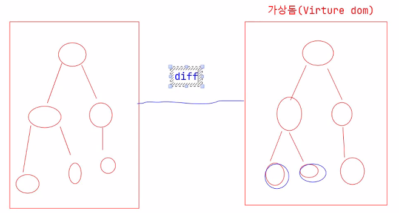
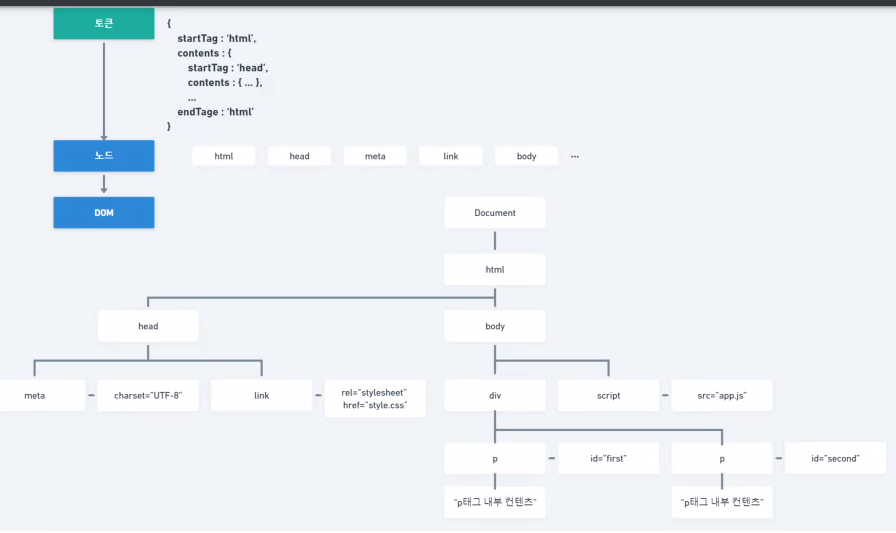
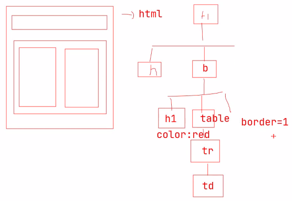

React 이해
==========================
# react의 장점
- react한테 내용을 넘기면 가상 트리에 내용이 들어가고, 값에 대한 변경점을 찾아 변경점이 있으면 업데이트하고, 없으면 고대로 둔다.
- 이 때 사용되는게 diff 알고리즘을 통해 어떤 것이 바뀌었는지 검사하는 것이다.
- 또한, 기존에는 매번 변경점이 있을때마다 html의 요소들을 처음부터 끝까지 렌더링 해야 했는데,
   리액트는 해당 변경점을 찾고 해당 요소만 변경하는 방식으로 사용한다.


# react 공식 홈페이지 알아두기
- https://ko.reactjs.org/ <- 참조하기

# html의 구조
## HTML -> DOM Tree(상속구조)
- 트리형식으로 태그의 안에 계속해서 자식 노드들이 들어간다.
- HTML과 CSS를 합쳐 render tree라고 하는데
- 이걸 버츄얼 트리라고 가상 돔을 만들어 변경점을 찾는것을 지원한다.
- 또한 어느 위치에 그려줄 것인지에 대한 내용을 배치할건지에 대한 레이아웃을 거치고 그 다음 페인트라는 것을 통해 그려준다.


# react 프로젝트 생성
## npm
- node package manager
  
### npm 버전 확인
- 컨트롤 + `하면 콘솔창 올라오고 
- npm -v 입력하면 버전을 확인할 수 있다.

### npm install -g cowsay
- npm의 cowsay를 패키지 전역에 설치하겠다.

### npx
- 깔린 npm을 실행하겠다는 명령어

### npx create-react-app test-react-app
- react 프로젝트를 생성하고 초기값 설정하겠다.

### npm start
- 설치된 npm을 실행시켜 리액트가 등장한다.
- 나중에 부트에 port연결을 시키면 부트 서버, 리액트 서버 두 개 띄우는거다.


#### 스크립트 객체 생성
``` javascript
const user = {
            name: "홍길동",
            age: 20,
            phone: '010-1234-5678',
            email: 'hong123@gmail.com',
        };

        // const name = user.name;
        // const age = user.age;

        // const user = {
        //     name: name,
        //     age: age,
        //     phone: phone,
        //     email: email,
        // };
        
        // const user = {
        //     name,
        //     age, 
        //     phone, 
        //     email,
        // }
// 셋 다 같은 형식이다
```

## DOM 트리 구조


- 부모 노드와 자식 노드를 트리형식으로 그리고,
- css에 대한 내용을 다시 트리형식으로 그린다.(css 쏨)

## ReactDOM(Virtual DOM)
- 이전에 만든 트리형식의 DOM을 복제해서,
- 변경점을 찾아내 모아놨다 렌더링 될 때 한번에 바꾼다.