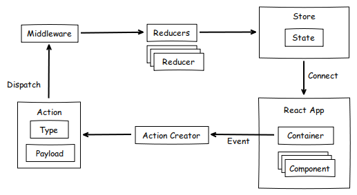

# 리덕스 미들웨어

## 작업 순서
### 기존
액션 ------> 리듀서 -----> 스토어 ----->

### 리덕스 미들웨어
액션 -----> 미들웨어 ------> 리듀서 -----> 스토어 ----->
- 액션이 디스패치 된 다음 리듀서에서 액션을 받아 업데이트 하기 전에 추가적인 작업을 수행할 수 있다.


---

## 각 이름별 정의
- 액션 : "상태 변화를 위한 수행을 나타내는 객체"
- 미들웨어 : 액션 처리로, 여기서 여러가지 기능을 넣을 수 있습니다. 
- 리듀서 : "스토어의 액션들을 수행하도록 해주는 함수"
- 스토어 : 상태 값들을 저장해두는 공간
- module: 초기값, 액션, 리듀서를 하나의 묶음으로 관리한다.
  
## 리덕스 미들웨어란 ?
- 특정 조건에 따라 액션 무시 및 추가 작업, 수정, 로깅, 트리거 액션, 함수 호출 등을 수행할 수 있다.
- 주로 사용하는 용도는 비동기 작업을 처리할 때 미들웨어를 사용해서 처리할 수 있다.
- 비동기 관련 미들웨어 라이브러리로 많이 사용되는게 redux-thunk, redux-sage가 있다.

### 기본 사용 예시
``` javascript
const middleware = store -> next -> action => {
    // 미들 웨어가 수행할 내용
}

function middlewear(store) {

    return function(next) {

        return function(action) {
            // 미들 웨어가 수행할 내용
        }
    }
}
```

### redux middle 웨어 사용한 app
``` javascript
/* 미들웨어 (커스텀 미들웨어) */
const consoleLoggingMiddleware = store => next => action => {

    console.log(action);
    const result = next(action); // 다음 미들웨어 혹은 리듀서에게 액션을 전달
    console.log('result', result);

    return result;
}

/* react-logger 미들웨어 */
const logger = reduxLogger.createLogger();

// 둘다 동일한 미들웨어이다.
/* ----------------------------------------------------------- */
// module : 초기값, 액션, 리듀서를 하나의 묶음으로 관리 

const { createAction, createActions, handleActions } = ReduxActions;

/* 초기값 */
const initialState = 0;

/* 액션 */
const INCREMENT = 'count/INCREASE';
const DECREMENT = 'count/DECREASE';

const {count: { increase, decrease }} = createActions({
    [INCREMENT]: (amount = 1) => ({ incrementValue: amount}),
    [DECREMENT]: (amount = 1) => ({ decrementValue: amount}),
});

/* 리듀서*/
const reducer = handleActions(
    {   
        // [INCREMENT]: (state, action) => {
        //    return state + action.payload.incrementValue;
        //}
        [INCREMENT] : (state, { payload: {incrementValue}}) =>{
            return state + incrementValue;
        },
        [DECREMENT] : (state, { payload: {decrementValue}}) =>{
            return state - decrementValue;
        }

    },
    initialState
);

/* -----------------------------------------------------------*/

/* ---------------------------- UI ----------------------------*/
const {useSelector, useDispatch } = ReactRedux;
function App() {

    const count = useSelector(state => state);

    const dispatch = useDispatch();

    /* 디스패치 */
    const increaseCount = () => {
        dispatch(increase());
    }

    const decreaseCount = () => {
        dispatch(decrease());
    }

    return (
        <>
            <h1>Count: { count }</h1>
            <button onClick={ increaseCount }>1증가</button>
            <button onClick={ decreaseCount }>1감소</button>
        </>
    );
}
/* ---------------------------- UI ----------------------------*/

/* store */
const { Provider } = ReactRedux;
const { createStore, applyMiddleware } = Redux;

/* 사용하려는 미들웨어를 두 번째 인자로 applyMiddleware 함수 인자형태로 전달한다. */
const store = createStore(reducer, applyMiddleware(logger, consoleLoggingMiddleware));
// 둘다 동일한 출력이다

ReactDOM.createRoot(document.getElementById('root')).render(
    <Provider store={store} >
        <App />
    </Provider>
);
```


