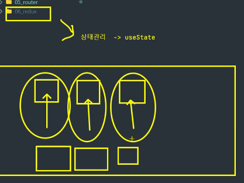

# Redux

## Redux란 ? 
- Redux는 자바스크립트 앱을 위한 예측 가능한 상태 컨테이너이다.
- 각 컴포넌트들의 상태값들이 많아지면 관리하기 어려우니까
  이것들을 관리하기 위한 하나의 객체(store)를 만들어 이 객체 안에
  컴포넌트들의 상태를 관리한다. 
- 즉, 각 컴포넌트별로 상태를 관리하기엔 유지보수가 힘드니까
- 총 관리자처럼 모든 컴포넌트에 대한 상태를 store에서 관리한다.
- 업무 단위의 도메인 단위별로 묶어서 나눠야 한다.
- 리덕스(redux)는 상태관리를 하기 위한 라이브러리이다.
- 앱의 상태 전부는 하나의 저장소(store)안에 있는 객체 트리에 저장된다.
- 상태 트리를 변경하는 유일한 방법은 어떤 행동이 일어날지에 해당하는
- action이다.
- action에 따라 상태를 어떻게 변경할지를 명시하기 위해 함수를 작성하고
  reducer함수라고 한다.


--- 

#### unpkg
- https://unpkg.com/패키지명@버전  버전에 latest 최신 버전을 제공


## redux 공식 홈페이지 퀵스타트 

### app/store.js
``` javascript
import React from 'react'
import ReactDOM from 'react-dom'
import './index.css'
import App from './App'
import store from './app/store'
import { Provider } from 'react-redux'

ReactDOM.render(
  <Provider store={store}>
    <App />
  </Provider>,
  document.getElementById('root')
) // 이런 식으로 store에 상태값을 보낸다.
```

### features/counter/counterSlice.js
``` javascript

import { createSlice } from '@reduxjs/toolkit'

export const counterSlice = createSlice({
  name: 'counter',
  initialState: {
    value: 0
  },
  reducers: {
    increment: state => {
      // Redux Toolkit allows us to write "mutating" logic in reducers. It
      // doesn't actually mutate the state because it uses the Immer library,
      // which detects changes to a "draft state" and produces a brand new
      // immutable state based off those changes
      state.value += 1
    },
    decrement: state => {
      state.value -= 1
    },
    incrementByAmount: (state, action) => {
      state.value += action.payload
    }
  }
})

// Action creators are generated for each case reducer function
export const { increment, decrement, incrementByAmount } = counterSlice.actions

export default counterSlice.reducer
```

## 리덕스의 3가지 원칙
1. Single source of truth
- 스토어라는 하나뿐인 데이터 공간(객체)을 이용하기 떄문에 신뢰할 수 있는 데이터이다.

2. State is read-only
- 리덕스에서는 액션을 전달하는 리듀서함수를 이용해서만 상태를 변경하여 직접 state를 변경하지 못한다.

3. Changes are made width pure function
- 변경은 오로지 순수 함수로만 가능하다.(리듀서를 이용)


## 리덕스의 예제

### 리덕스-html로 구성 예제
``` html
<!DOCTYPE html>
<html lang="en">
<head>
    <meta charset="UTF-8">
    <meta http-equiv="X-UA-Compatible" content="IE=edge">
    <meta name="viewport" content="width=device-width, initial-scale=1.0">
    <title>Document</title>
    <!-- https://unpkg.com/패키지명@버전  버전에 latest 최신 버전을 제공-->
    <script src="https://unpkg.com/redux@4.2.1/dist/redux.js"></script>
    <!-- 기존 npm을 통해 install하던 것을 cdn방식으로 불러온다. -->
</head>
<body>
    <script>
        
        /* 리덕스(redux)는 상태관리를 하기 위한 라이브러리이다.
            앱의 상태 전부는 하나의 저장소(store)안에 있는 객체 트리에 저장된다.
            상태 트리를 변경하는 유일한 방법은 어떤 행동이 일어날지에 해당하는 action이다.
            action에 따라 상태를 어떻게 변경할지를 명시하기 위해 함수를 작성하고 reducer함수라고 한다.
        
            리덕스의 3가지 원칙
            1. Single source of truth
            - 스토어라는 하나뿐인 데이터 공간(객체)을 이용하기 떄문에 신뢰할 수 있는 데이터이다.
            2. State is read-only
            - 리덕스에서는 액션을 전달하는 리듀서함수를 이용해서만 상태를 변경하여 직접 state를 변경하지 못한다.
            3. Changes are made width pure function
            - 변경은 오로지 순수 함수로만 가능하다.(리듀서를 이용)
        */

        const { createStore } = Redux;

        // 리듀서
        // (state, action) => state형태의 순수 함수 형태로 리듀서를 작성한다.
        // state 객체는 변경해서는 안되고, 상태가 바뀌면 반드시 새로운 객체를 생성해서 반환해야 한다.
        // 일반적으로 spread 연산자를 이용할 수 있다.

        /* action은 store에 운반할 데이터를 말하며 주문서와 비슷한 개념이다. */

        /* 
            {  // 객체로 넘긴다
                type: "ACTIVE_NAME", <- 얘는 필수로 넣어줘야 한다.                      // 필수 값
                payload: {name: "홍길동", age: 20} <- 있어도 되고 없어도 된다.          // 옵션 값
            }
        */
       /* 리듀서 함수 만들기 */
        function counter(state = 0, action) { /* state인자 값에 기본값을 대입할 수 있다. */

            switch(action.type) {
                case 'INCREMENT':
                    return state + 1;
                case 'DECREMENT':
                    return state - 1;
                default:
                    return state;
            }
        }

        /* 스토어 생성하여 리듀서 함수 담아주기 */
        const store = createStore(counter);
        console.log(store);

        /* 스토어의 상태변화를 구독할 함수를 콜백함수로 전달한다. 
            getState로 state값 확인 가능
        */
       /* ++추가정보++
        - 구독 (subscribe)
        : 스토어의 내장함수 중 하나. subscribe 함수 안에 리스너 함수를 파라미터로 넣어서 호출해 주면, 이 리스너 함수가 액션이 디스패치되어 상태가 업데이트 될 때마다 호출된다.
        by책 
        */
        store.subscribe(() => console.log(store.getState()));
        /* 스토어의 상태가 변화가 있을때마다 호출시켜준다. */
        
        /* dispatch는 리듀서 함수를 호출하며,
            state는 현재 상태를 리듀서 호출 시 알아서 넣어준다.

            state를 변경하는 유일한 방법은 액션을 생성해서 dispatch하는 것 뿐이다.
        */
       store.dispatch({ type: 'INCREMENT'});
       store.dispatch({ type: 'INCREMENT'});
    </script>
</body>
</html>
```

### react 버전으로 구성 예제
- 리액트에선 훅을 이용해 상태값을 가져온다. 
- 훅 종류
1. Provider
- 변경점에 대한 내용들을 써줘야 할 때 store에 해당 값을 prop에 전달하는데 구독을 자동으로 해준다.
- 즉, provider로 store를 props형태로 전달하면 하위 컴포넌트는 store를 자동으로 구독한다.
==> state가 변경되면 렌더링이 된다는 의미이다.
- provider의 store가 추가해야하고, 위에서 생성한 store의 객체 명을 사용한다.
``` javascript
ReactDOM.createRoot(document.getElementById('root')).render(
    <Provider store={ store }>
        <App />);
    </Provider>
);
```

1. useSelector
- ReactRedux에서 제공하는 useSelecotr hook을 이용하여 state를 이용할 수 있다.
- useSelector는 반드시 인자로 state를 매개변수로 하는 함수를 콜백으로 전달해야 한다.


3. useDispatch
- useDispatch hook을 이용하여 dispatch를 호출할 수 있다.
- state 변경에 필요한 값은 payload 속성에 담는다.


``` html
<!DOCTYPE html>
<html lang="en">
<head>
    <meta charset="UTF-8">
    <meta http-equiv="X-UA-Compatible" content="IE=edge">
    <meta name="viewport" content="width=device-width, initial-scale=1.0">
    <title>Document</title>
    <script crossorigin src='https://unpkg.com/react@18/umd/react.development.js'></script>
    <script crossorigin src='https://unpkg.com/react-dom@18/umd/react-dom.development.js'></script>
    <script src='https://unpkg.com/@babel/standalone/babel.min.js'></script>
    <script src="https://unpkg.com/redux@4.2.1/dist/redux.js"></script>
    <script src="https://unpkg.com/react-redux@8.0.5/dist/react-redux.js"></script>
</head>
<body>
    <div id='root'></div>
    <script type='text/babel'>
        const { Provider, useSelector, useDispatch } = ReactRedux;

        const { createStore } = Redux;

        /* state를 변경하기 위한 함수 작성 
        action은 dispatch를 호출하는 쪽에서 전달해주는 값으로
        행위의 종륭화 state변경에 대한 내용(payload)을 담고있다.
        */
        const initialState = 0;
        function reducer(state = initialState, action){
            
            const {type, payload} = action; // dispatch로 사용할 타입과 내용 비구조화 할당
            
            switch(type) {
                case 'INCREAMENT':
                    return state + payload.incrementValue;
                case 'DECREAMENT':
                    return state - payload.decrementValue;
                default:
                    state;
            }

            // console.log(type);
            // console.log(payload);
        }

        /* 비구조화 할당은 중첩이 가능하다. */
        // const user = {
        //     name: '홍길동',
        //     type: {
        //         age:1,
        //         address: '서울시'
        //     }
        // }
        
        // console.log(user);
        
        // const {name, type:{age, address}} = user;
        // console.log(name);
        // console.log(age);
        // console.log(address);
        
        /* reducer함수를 이용하여 store 객체 생성 */
        const store = createStore(reducer);

        function App() {
            /* 
                useSelecotr hook을 이용하여 state를 이용할 수 있다.
                useSelector는 반드시 인자로 state를 매개변수로 하는 함수를 콜백으로 전달해야 한다.
            */
            const count = useSelector(state => state); // 화살표 함수는 인자가 하나이면 리턴구문 생략이 가능하다.

            /* useDispatch hook을 이요하여 dispatch를 호출할 수 있다.
                state 변경에 필요한 값은 payload 속성에 담는다.
            */
            const dispatch = useDispatch();

            const increaseCount = () => {
                /* dispatch의 시점은 여기서 사용 */
                dispatch({
                    type: "INCREAMENT",     // 나중에 사용할 때 불러올 이름
                    payload: {
                        incrementValue: 1   // 1씩 값을 바꾸겠다고 설정
                    }
                });
            };

            const decreaseCount = () => {
                dispatch({
                    type: "DECREAMENT",
                    payload: {
                        decrementValue: 1
                    }
                });
            };
            

            return (
                <>
                    <h1>Count : {count}</h1>
                    <button onClick= {increaseCount}>1 증가 </button>
                    <button onClick= {decreaseCount}>1 감소 </button>
                </>
            );
        }

        ReactDOM.createRoot(document.getElementById('root')).render(
        /* 
            provider로 store를 props형태로 전달하면 하위 컴포넌트는 store를 자동으로 구독한다.
            ==> state가 변경되면 렌더링이 된다는 의미이다.
            provider의 store가 추가해야하고, 위에서 생성한 store의 객체 명을 사용한다.
        */    
        <Provider store={ store }>
            <App />
        </Provider>
        );
    </script>
</body>
</html>
```

## 여러 개의 상태 값 관리
- 여러 리듀서를 하나의 rootReducer로 묶을 때 combineReducers를 이용한다. 
- 서로 관련있는 상태 변경에 대한 로직을 각 함수로 분리하면서 관리가 수월해진다.

``` javascript
<!DOCTYPE html>
<html lang="en">
<head>
    <meta charset="UTF-8">
    <meta http-equiv="X-UA-Compatible" content="IE=edge">
    <meta name="viewport" content="width=device-width, initial-scale=1.0">
    <title>Document</title>
    <script crossorigin src='https://unpkg.com/react@18/umd/react.development.js'></script>
    <script crossorigin src='https://unpkg.com/react-dom@18/umd/react-dom.development.js'></script>
    <script src='https://unpkg.com/@babel/standalone/babel.min.js'></script>
    <script src="https://unpkg.com/redux@4.2.1/dist/redux.js"></script>
    <script src="https://unpkg.com/react-redux@8.0.5/dist/react-redux.js"></script>
</head>
<body>
    <div id='root'></div>
    <script type='text/babel'>
        
        const { Provider, useSelector, useDispatch } = ReactRedux;
        const { combineReducers, createStore } = Redux;

        /* 관리해야할 상태들을 설정해둔다.*/
        const countInitState = {
            currentCount: 0
        }

        const activationInitState = {
            isActivity: false
        }

        const userInitState = {
            name: '',
            email: '',
            phone: ''
        }

         /* 여러 리듀서를 하나의 rootReducer로 묶을 때 combineReducers를 이용 
           서로 관련 있는 상태 변경에 대한 로직을 각 함수로 분리하면서 관리가 수월해진다.
        */
        const rootReducer = combineReducers({
            countReducer: (state = countInitState, action) => {
                const { type, payload } = action;

                switch(type){
                    case 'INCREMENT':
                        return {
                            currentCount: state.currentCount + payload.incrementValue
                        };
                    case 'DECREMENT':
                        return {
                            currentCount: state.currentCount - payload.decrementValue
                        };
                    default:
                        return state;
                }
                
            }
            ,
            activationReducer: (state = activationInitState, action) => {

                const { type } = action;

                switch(type) {
                    case 'TOGGLE':
                        return {
                            isActivity: !state.isActivity
                        };
                    default:
                        return state;
                }
            },
            userReducer: (state = userInitState, action) => {

                const {type, payload } = action;

                switch(type) {
                    case 'INPUT':
                        return {
                            ...state,
                            [payload.name]: payload.value
                        };
                    default:
                        return state;
                }
            }
        });


        /* 여러개 묶은 상태들을 최종 통합 store에 넣어준다. */
        const store = createStore(rootReducer);

        function App() {
            /* combineReducers를 이용하는 경우 useSelector의 콜백함수 매개변수로 rootReducer의 state가 반환*/
            const { currentCount } = useSelector(state => state.countReducer);
            const { isActivity } = useSelector(state => state.activationReducer);
            const { name, email, phone } = useSelector(state => state.userReducer); 

            const dispatch = useDispatch(); // dispatch 훅 선언

            const increaseCount = () => {
                /* dispatch의 시점은 여기서 사용 */
                dispatch({
                    type: 'INCREMENT',     // 나중에 사용할 때 불러올 이름
                    payload: {
                        incrementValue: 1   // 1씩 값을 바꾸겠다고 설정
                    }
                });
            };

            const decreaseCount = () => {
                dispatch({
                    type: 'DECREMENT',
                    payload: {
                        decrementValue: 1
                    }
                });
            };
            

            const toggleActivation = () => {
                dispatch({type: 'TOGGLE'});
            }

            const onChangeHandler = (e) => {
                dispatch({
                    type: 'INPUT',
                    payload: {
                        name: e.target.name,
                        value: e.target.value
                    }
                })
            }

            return (
                <>
                    <h1>currentCount : { currentCount }</h1>
                    <button onClick={increaseCount}>1 증가</button>
                    <button onClick={decreaseCount}>1 감소</button>
                    <h1>isActivity : { isActivity.toString() }</h1>
                    <button onClick={ toggleActivation }>toggle activation</button>
                    <br />
                    <h3>input control</h3>
                    <label>name : </label>
                    <input type="text" name="name" value={name} onChange={ onChangeHandler } />
                    <br />
                    <label>email : </label>
                    <input type="text" name="email" value={email} onChange={ onChangeHandler } />
                    <br />
                    <label>phone : </label>
                    <input type="text" name="phone" value={phone} onChange={ onChangeHandler } />
                    <br />
                    <h3>name : {name}</h3>
                    <h3>email : {email}</h3>
                    <h3>phone : {phone}</h3>
                </>
            );
       }

        ReactDOM.createRoot(document.getElementById('root')).render(
        <Provider store={ store }>    
            <App />
        </Provider>
        );
    </script>
</body>
</html>
```