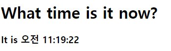

# rendering
- 해당 html에 안에 들어가는 모든 엘리먼트를 ReactDOM에서 관리하기 떄문에, 이것을 루트(root)DOM 노드라고 부른다.
- 일반적으로 React로 구현된 애플리케이션은 하나의 루트 DOM노드가 있다.
- 단, 리액트를 기존 앱에 통합하려는 경우 원하는 만큼의 독립된 루트 DOM노드를 가질 수 있다.

## render element
``` javascript
<script type="text/babel">
    const element = (
        <>
            <h1>What time is it now?</h1>
            <h3 // {} 안에는 자바스크립트 문법이 들어갈 수 있다. 
            >It is {new Date().toLocaleTimeString()}</h3>
        </>
    );
    // React Element를 루트 DOM 노드에 렌더링 하면 ReactDOM.createRoot(루트 DOM노드).render(렌더링할 엘리먼트)
    ReactDOM.createRoot(document.getElementById('root')).render(element);
</script>
```

## rendered-element-update
- 리액트 엘리먼트는 불변객체(immurable)이다.
- 엘리먼틀르 생성한 이후에는 해당 엘리먼트의 자식이나 속성을 변경할 수 없다.
- 기존에 있던 내용에서 변경이 되면 기존 내용을 수정하는게 아닌,
  버리고 새로이 작성하는 방식이다.
- 즉, 엘리먼트를 업데이트하기 위해서는 완전히 새로운 엘리먼트를 만들고,
  ReactDOM.rander로 다시 렌더링을 하는 방식을 사용한다.

### window의 함수
``` javascript
// console.log(window); // 전역변수로 되어있어 console같은애들을 그냥 사용할 수 있는 것이다.
// console.log(window.setTimeout); // 정해진 시간에 정해진 이벤트를 발생해라. // 비동기 방식
// console.log(window.setInterval); // 정해진 시간에 정해진 함수를 발생시켜라(무한정 발생) // 비동기 방식
// console.log(window.clearInterval); // 해당하는 주소값을 가지고 따라다니며 정해진 시간에 맞춰 끊어주는 역할

// console.log('test'); // 실행이 됐을 때 test를 찍어줘
// window.setTimeout(() => {
//     console.log('test');
// }, 1000); // 정해진 시간에  test를 찍어줘
// console.log('end');

// window.setInterval(() => {
//     console.log('test');
// }, 1000);

// console.log("end2");

// const setInterval = window.setInterval(() => {
//     console.log("test");
    
//     window.setTimeout(() => {
//         window.clearInterval(setInterval);
//     }, 3000);
// }, 1000);
```

### 함수를 이용한 렌더링
``` javascript
function tick() {
    const element = (
        <>
            <h1>What time is it now?</h1>
            <h3>It is {new Date().toLocaleTimeString()}</h3>
        </>
    );
    ReactDOM.createRoot(document.getElementById('root')).render(element);
}
tick();
```

### update 렌더링
``` javascript
function tick() {
    /*
        1초마다 tick 함수를 호출해서 새로운 엘리먼트를 생성하고, rendering 하고있는 것이다.
    */
    const element = (
        <>
            <h1>What time is it now?</h1>
            <h3>It is {new Date().toLocaleTimeString()}</h3>
        </>
    );
    ReactDOM.createRoot(document.getElementById('root')).render(element);
}

setInterval(tick, 1000);
```

- 필요한 내용들만 변경을 하고 새로이 만들어 다시 렌더링 하는 방식이다.
- 비동기 같은 느낌으로 생각하자.

## 조건부 렌더링
- 여러 개의 엘리먼트 중 특정 조건에 따라 하나의 엘리먼트만 렌더링 할 수 있다.
``` javascript
<script type="text/babel">
const answer = parseInt(window.prompt('리액트가 재미있으신가요? \n 1. 재미있다. \n 2. 어렵다.')); // 모든 값을 string 타입으로 반환
console.log(typeof answer); // 1 입력 시 '1' 문자열로 들어온다.
</script>
```

#### 문자열을 숫자형태로 변경하는 함수
1. parseInt
2. parseFloat
- 표현 범위까지는 표현하고 표현 못하는건 끊어버린다.

3. parseNumber
- 안에 있는 내용 중 문자열이 하나라도 붙어있으면 NaN으로 반환

### 1. 렌더링 시 조건비교 후 조건부 렌더링 하기 */
``` javascript
const positiveElement = <h1>앞으로 점점 더 재밌어 질 거에요 ^^</h1>
const negativeElement = <h1>천천히 앞의 내용을 복습해보세요.</h1>
        
        ReactDOM.createRoot(document.getElementById('root')).render(
            answer === 1 ? positiveElement : negativeElement
        ); // 삼항 연산자를 이용하여 답장을 선택한다.
```
#### 1 입력시 뷰


#### 2 입력시 뷰


### 2. JSX 내에서 조건부로 엘리먼트 생성

#### 2-1. if문으로 조건부 엘리먼트 생성
``` javascript
let element;
    if(answer ===1) {
        element = <h1>앞으로 점점 더 재밌어 질 거에요 ^^</h1>
    } else {
        element = <h1>천천히 앞의 내용을 복습해보세요.</h1>
    }
```

##### 1 입력시 뷰


##### 2 입력시 뷰


#### 2-2. 삼항 연산자로 조건부 엘리먼트 생성
- if문과 동작은 똑같지만, 표현 방법이 다르다.
``` javascript
let element = answer === 1 ? (
        <h1>앞으로 점점 더 재밌어 질 거에요 ^^</h1>
    ) : (
        <h1>천천히 앞의 내용을 복습해보세요.</h1>
    );

ReactDOM.createRoot(document.getElementById('root')).render(element);
```

#### 2-3. && 연산자를 이용한 조건부 엘리먼트 생성
- 특정 조건을 만족하는 경우에만 렌더링을 하고, 
  그렇지 않은 경우 아무것도 보여지지 않게 하고싶은 경우 사용할 수 있다.
``` javascript
// const element = answer === 1 ? <h1>앞으로 점점 더 재밌어 질 거에요^^</h1> : null;
const element = answer === 1 && <h1>앞으로 점점 더 재밌어 질 거에요^^</h1>;
// 삼항연산자로 작성한 로직과 현재 로직은 동일하다.

ReactDOM.createRoot(document.getElementById('root')).render(element);
```

##### 주의사항
- falsy값은 boolean값에서 false로 평가되는 값
- falsy값 : null, undefined, 0, NaN, '' 가 있다.

- false 조건을 가지고 렌더링을 하는 경우 조건에 일치하지 않으면 렌더링 되는 요소가 없지만,
  0과 같은 falsy한 값을 이용해 조건부 엘리먼트 생성을 하게 되면 0을 반환한다. 

###### 0의 상태
``` javascript
const number = 0; // 0 반환
// const number = null; // 반환 x
// const number = undefined; // 반환  x

const element = number && <h1>0이 아닙니다.</h1>;

ReactDOM.createRoot(document.getElementById('root')).render(element);
```
- 즉, falsy값 들은 기본적으로 조건에 일치하지 않으면 렌더링 하지 않지만,
  0은 특별하게 0을 반환한다.

###### undefined의 오류
- ReactDOM의 .render(element)에서
- 엘리먼트 부분에 undefiend가 들어가면 오류가 발생한다.
``` javascript
let name = undefined;
const element = { name }; // 엘리먼트 자체가 undefined이면 에러가 발생한다.

ReactDOM.createRoot(document.getElementById('root')).render(element);
```


###### JSX 내의 undefined 값 표현
``` javascript
let name = undefined;
const element = <h1>Hello, { name }</h1>; 
// JSX내에서 undefined값을 표현식에 이용하면 그 값 그대로 엘리먼트를 생성한다.
// const element = <h1>Hello, {name || '홍길동'}</h1>; 
// 바벨6에서는 되는데, 7에서는 판정이 이상하다.
```
