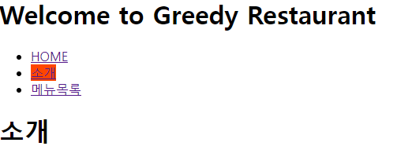
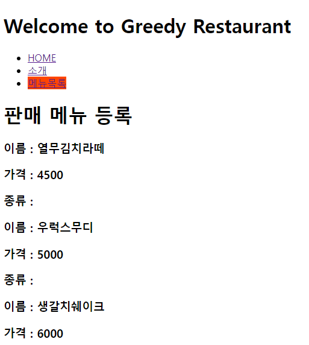
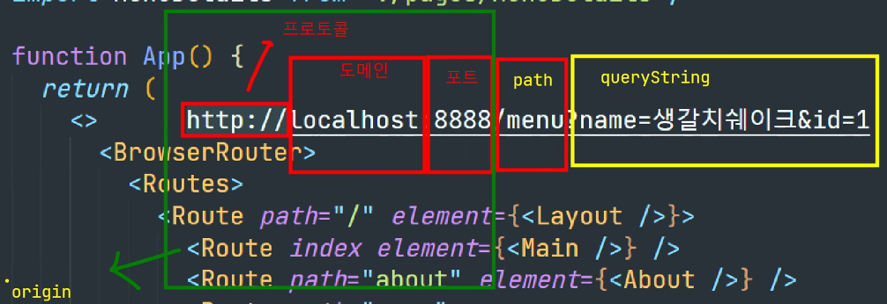

# React Router Dom
- /로 페이지 요청이 들어오면 정해져있는 경로들이 있고 그 경로에 해당하는 컴포넌트를 매핑시킨다.
- React를 실행하기 위해서는 
package.json 파일이 있는 곳까지가야함
ctrl + c 누르면 종료하겠습니까? 나옴
npm install react-router-dom@6  -> @6 : 6버전

package.josn : pom.xml이랑 유사함

git에 공유할때에는 /node_modules는 ignore에 추가되어있음.
(여기에 모든 lib이 들어가있어서 공간이 큼.)
-> package.json에 추가되어 있는 것만 다시 다운받을 것이기 때문에 상관 x

삭제 : npm uninstall react-router-dom@6
-> 근데 package.json에서 디펜던시?는 지워주지 않기 때문에 수동으로 삭제해줘야함

## React Router 설치
1. 터미널에서 npm install react-router-dom@6 를 입력하여 설치를 한다.
-  @6은 버전이다. 
2. 설치하게 되면 package.json 파일에 해당하는 dependencies에 설치가 된다.
- 혹시나 잘못 설치했다면 uninstall로 변경해서 제거한다.
- node_modules에는 지워지지만 package.json에선 지워지지 않기 때문에 dependesis 지워야 한다.
  

## React Router 사용

#### 웹 팩
- js에 대한 내용들을 한데 묶어 모아놓은 것 

### BrowserRouter 컴포넌트를 이용한 경로 설정을 위한 App.js 작성
``` javascript
import React from 'react';
import { BrowserRouter, Routes, Route } from 'react-router-dom';
import Main from './pages/Main';
import About from './pages/About';
import Menu from './pages/Menu';
/* 
  BrowserRouter 컴포넌트를 이용하여 라우팅 설정을 해준다.
  path는 경로를, element는 보여줄 컴포넌트
  path="/" 는 기본 인덱스를 바라본다. path를 사용하지 않고 index로도 사용할 수 있다.
*/
function App() {
  return (
    <>
    <BrowserRouter>
      <Routes>
        {/* <Route path="/" element={ <Main /> } /> */}
        {/* 인덱스로 설정해두면 위의 설정{루트 요청}과 동일하다. */}
        <Route index element={<Main />} />

        <Route path="/about" element={ <About /> } />
        <Route path="/menu" element={ <Menu /> } /> 
     </Routes>
    </BrowserRouter>
    </>
  );
}

export default App; // 외부로 가져가 사용해라
```

### Link 컴포넌트를 이용한 링크 연결을 위한 Main.js 작성
``` javascript
/* 
    다른 페이지 링크 설정
    1. Link 컴포넌트를 import 한다.
    2. Link 컴포넌트의 to 속성에 연결할 url을 작성하고
        텍스트 노드로 보여줄 텍스트를 설정한다.
*/
import { Link } from 'react-router-dom';

function Main() {
    
    return (
        <div>
            <h1>메인</h1>
            <nav>
            <ul>
                <Link to="/">HOME</Link> <br/>
                <Link to="/about">소개</Link> <br/>
                <Link to="/menu">메뉴목록</Link> <br/>
            </ul>
            </nav>
        </div>
    );
}

export default Main;
```

## outlet을 이용한 컨텐트영역 설정
``` javascript
import Header from "../components/Header"
import Navbar from "../components/NavBar"

/* 
    Outlet 컴포넌트는 라우팅 되는 컴포넌트를 대체하기 위한 마커 역할을 한다.
    헤더나 공통적인 역할을 수행하는 nav영역 같은 경우 레이아웃으로 위치를 지정하고
    Outlet으로 라우팅 될 컴포넌트를 대체하기 위한 표기만 해두면
    Outlet에 해당하는 부분만 변경이 되게 된다.
*/
function Layout() {

    return (
        <>
            <Headers />
            <Navbar />
            <Outlet />
        </>
    );
}

export default Layout;
```

## <NavLink> 활용
- NavLink 컴포넌트는 Link 컴포넌트와 사용이 거의 유사하다.
- 하지만 현재 nav의 상태가 active인지에 대한 값을 이용하여
  스타일을 조작하거나 클래스 이름을 변경할 수 있다.
``` javascript
import { NavLink } from 'react-router-dom';

function Navbar() {

    const activeStyle = {
        backgroundColor: 'orangered'
    }

    return (
        <div>
            <ul>
                <li><NavLink to="/" style={ ({isActive}) => isActive ? activeStyle:undefined}>HOME</NavLink></li>
                <li><NavLink to="about" style={ ({isActive}) => isActive ? activeStyle:undefined}>소개</NavLink></li>
                <li><NavLink to="menu" style={ ({isActive}) => isActive ? activeStyle:undefined}>메뉴목록</NavLink></li>
            </ul>
        </div>
    );
}

export default Navbar;
```


# 컴포넌트 참조
- 함수는 기본적으로 컴포넌트 내부에서만 참조되는데,
- 함수에 export를 붙이면 외부에도 사용할 수 있다.

## 함수 컴포넌트화 하여 외부에 전송
``` javascript
export function getMenuList() {

    return menus;
}
```

## 외부에서 사용할 함수 참조하여 값 조회하기
``` javascript
import { useState, useEffect } from 'react';
import MenuItem from '../components/MenuItem'
import { getMenuList } from '../api/MenuAPI';

function Menu() {

    const [menuList, setMenuList] = useState([]);

    useEffect(
        () => {
            /* DB에 데이터를 요청해서 결과를 반환 받는다. */
            setMenuList(getMenuList());
        }, []
    );

    return (
        <>
        <h1>판매 메뉴 등록</h1>

        <div>
            {menuList.map(menu => <MenuItem key={menu.menuCode} menu={menu} />)}
        </div>
        </>
    );
}

export default Menu;
```

### 결과


---

## useParams를 이용하여 값 가져오기
- useParams 훅을 이용하여 pathvariable 값을 읽을 수 있다.
- 매핑도 가능하며, 값을 불러올 수 있다.
``` javascript
import { useEffect, useState } from 'react';
import { useParams } from 'react-router-dom';
import { getMenuDetail } from '../api/MenuAPI';

function MenuDetails() {

    /* useParams 훅을 이용하여 pathvariable 값을 읽을 수 있다. */
    const { menuCode } = useParams();

    console.log(useParams()); /* 키 값 형태의 문자열로 menuCode 가 넘겨져 온다.*/
    const [menu, setMenu] = useState({
        menuName: '',
        menuPrice: 0,
        categoryName: '',
        detail: {}
    });

    useEffect(
        () => {
            console.log(getMenuDetail(menuCode));
            setMenu(getMenuDetail(menuCode));
        }
    )

    return (
        <>
            <h2>메뉴 상세 설명</h2>
            <h3>메뉴 이름 : { menu.menuName }</h3>
            <h3>메뉴 가격 : { menu.menuPrice }</h3>
            <h3>메뉴 종류 : { menu.categoryName }</h3>
            <h3>메뉴 설명 : { menu.detail.description }</h3>
            
        </>
    );
}

export default MenuDetails;
```

# queryString


---

## queryString 형태의 값 받기
- 쿼리 스트리(queryString)형태로 전달된 값은 useSearchParams hooks를 이용해서 전달받을 수 있다.


### MenuSearchResult.js

``` javascript
import { useSearchParams } from 'react-router-dom';
import boxStyle from './Menu.module.css';
import { useEffect, useState } from 'react';
import MenuItem from '../components/MenuItem';
import { searchMenu } from '../api/MenuAPI';


function MenuSearchResult() {

    /* 쿼리 스트리(queryString)형태로 전달된 값은 useSearchParams hooks를 이용해서
        전달받을 수 있다.
    */
    const [searchParams] = useSearchParams();
        

    console.log(searchParams.get('menuName'));
    
    /* 쿼리스트링의 key값을 get함수에 전달해서 해당 파라미터 값을 읽어온다. */
    const menuName = searchParams.get('menuName');
    const [menuList, setMenuList] = useState([]);

    useEffect( // 그려주는 부분
        () => {
            /* 검색어를 전달해서 해당 이름이 포함된 메뉴를 검색한 후 결과를 배열로 반환받는다. */
            setMenuList(searchMenu(menuName)); // 전달받은 메뉴 네임 전달해주면
        }, [menuName] // 메뉴 네임이 변경됐을 때만 상태값을 변경해주겠다.
    );
    return (
        <div>
          <h1>검색된 메뉴</h1>
          <div className={ boxStyle.MenuBox }>
                {menuList.map(menu => <MenuItem key={menu.menuCode} menu={menu} />)}
          </div>  
        </div>
    );
}

export default MenuSearchResult;
```

### Menu.js
``` javascript
import { useState, useEffect } from 'react';
import MenuItem from '../components/MenuItem'
import { getMenuList } from '../api/MenuAPI';
import boxStyle from './Menu.module.css';
import { useNavigate } from 'react-router-dom';

function Menu() {

    const [menuList, setMenuList] = useState([]);
    const [searchValue, setSearchValue] = useState('');
    const navigate = useNavigate();

    useEffect(
        () => {
            /* DB에 데이터를 요청해서 결과를 반환 받는다. */
            setMenuList(getMenuList());
        }, []
    );

    /* 검색 기능 */
    const onClickHandler = () => {

        navigate(`/menu/search?menuName=${ searchValue }`);
    }

    return (
        <>
        <h1>판매 메뉴 등록</h1>
        
        <div>
            <input 
                type="search" 
                name="menuName" 
                value={ searchValue } 
                onChange={e => setSearchValue(e.target.value)} />
            <button onClick={ onClickHandler }>검색</button>
        </div>

        <div className={boxStyle.MenuBox}>
            {menuList.map(menu => <MenuItem key={menu.menuCode} menu={menu} />)}
            {/* 반복을 돌린다. */}
        </div>
        </>
    );
}

export default Menu;
```

### MenuAPI.js
``` javascript
import menus from '../data/menu-detail.json';

/* 전체 메뉴 목록 조회 */
export function getMenuList() {

    return menus;
}

/* 메뉴 코드를 이용하여 메뉴 한 개의 상세 내용 조회 */
export function getMenuDetail(menuCode) {

    return menus.filter(menu => menu.menuCode === parseInt(menuCode))[0];
}

/* 메뉴 이름을 전달받아 메뉴 이름을 포함하고 있는 메뉴 목록 반환 */
export function searchMenu(menuName) {

    return menus.filter(menu => menu.menuName.match(menuName)); /* match 안에 특정 단어가 있으면 포함하는것을 가져온다. */
}
```

## Navigate
- Navigate 컴포넌트로 강제로 to에 기입된 주소로 이동시키고,
  replace 속성을 true로 활성화해서 뒤로 되돌아가기를 막아놓을 수 있다.
  즉, 로그인 기준으로 로그인 안됐을 시 로그인 페이지로 이동하게 하는 곳 
``` javascript
import { Navigate } from "react-router-dom";

function MyPage() {

    const isLogin = false;

    console.log(isLogin);

    if(!isLogin) {
        return <Navigate to="/login" replace={true} /> 
        /* 이 부분이 로그인 안됐을 시 로그인 페이지로 이동하게 하는 곳 
            Navigate 컴포넌트로 강제로 to에 기입된 주소로 이동시키고,
            replace 속성을 true로 활성화해서 뒤로 되돌아가기를 막아놓음
        */
    }

    return (
        <div>
            <h1>마이페이지</h1>
        </div>
    );
}

export default MyPage;
```

