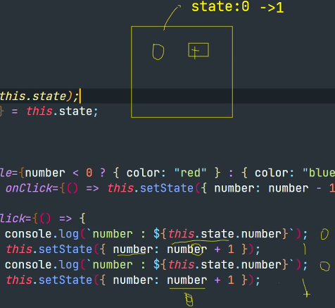
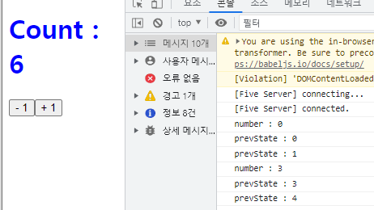
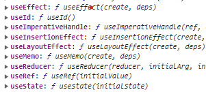
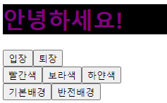

# state
- state란 컴포넌트 내부에서 바뀔 수 있는 값을 의미한다.
- 말 그대로 얘가 갖고있는 상태값이다.
- 컴포넌트가 있으면 컴포넌트가 일으킨 특정한 상태값을 나타낸다.
- 자기 자신의 상태값을 가지고 A를 쓸거냐 B를 쓸거냐에 대한 상태값
- 유상태와 무상태를 가지고 있다.(상태값을 갖고 있거나 가지고 있지 않은 애들)
- props는 컴포넌트가 사용되는 과정에서 부모 컴포넌트가 설정하는 값이지만, 
  state는 컴포넌트 내부에서 설정되는 값이다.
- props는 읽기 전용으로만 사용되지만, state는 변경되는 값을 관리한다.
- 리액트는 클래스형 컴포넌트에서 state를 직접 사용할 수 있다.
- 하지만 함수형 컴포넌트에서느 직접 state를 사용하는 것이 불가능하다.
- 따라서, 함수형 컴포넌트에서도 state를 관리할 수 있는 기능을 useState라는 hooks로 제공하고 있다.

# 클래스를 이용한 상태값 

## state 문제점
- 값에 있는 내용들을 여러 곳에서 사용하면 관리하는데 문제가 생긴다.
- 유지 관리를 해줄 때 어느 상태일 때 값이 바뀌었는지 추적하기 어렵다.
- 그래서 자기 내부에서만 상태값을 바꿔서 전달하는 방향으로 채택하고있다.

``` javascript
class Counter extends React.Component {

    // 컴포넌트를 생성할 때 가장 먼저 호출되는 생성자 함수
    constructor(props){
        // 부모 컴포넌트로 전달받은 props를 부모 클래스의 생성자에 전달하면서 컴포넌트를 생성한다.
        super(props);

        /* state를 초기화 : state는 생성자 안에서만 초기화가 가능하다. */
        // 이 컴포넌트(Counter)에 대한 상태값을 가지고 있어야 하기 때문에 this.으로 사용
        this.state = { // 아래 상태 값을 관리한다.
            number: 0, 
        };
    }

    render() {
        const {number} = this.state;

        /* state의 값을 변경하기 위해서는 setState 함수를 이용해야 한다. */
        return (
            <>
                <h1 style={number < 0 ? {color : "red"} : {color : "blue"}}>Count: {number}</h1>
                <button onClick={() => this.setState({number: number - 1})}>- 1</button>
                <button onClick={() => this.setState({number: number + 1})}>+ 1</button>
            </>
        );
    }
}

ReactDOM.createRoot(document.getElementById('root')).render(<Counter />);
```

## state만 사용 했을 때
- 생성자 함수 없이 클래스의 속성으로 state를 추가하는 것도 가능하다.
- 이 때 this.은 사용이 불가능 하다.
- this.은 인스턴스 생성 후 레퍼런스를 보관할 변수이기 때문에,
  생성자 혹은 함수 내에서만 사용이 가능하다. 

``` javascript
class Counter extends React.Component {

    /*
        생성자 함수 없이 클래스의 속성으로 state를 추가하는 것도 가능하다.
        이 때 this.은 사용이 불가능 하다.
        this.은 인스턴스 생성 후 레퍼런스를 보관할 변수이기 때문에
        생성자 혹은 함수 내에서만 사용이 가능하다. 
    */
    state = {  
        number: 0
    };

    render() {
        // console.log(this.state);
        const {number} = this.state;
        
        return (
            <>
                <h1 style={number < 0 ? { color : "red" } : { color : "blue" }}>Count : {number}</h1>
                <button onClick={() => this.setState({ number: number - 1})}>- 1</button>
                <button onClick={() => {
                /* 비동기 방식으로 state를 업데이트 하기 때문에 상태 변경을 하지만 반영되는 상태는 아니다.
                    메모리에만 임시로 변경된 상태를 가지고 해당 함수가 종료되면 변경 내역을 반영한다.
                            */
                    console.log(`number : ${this.state.number}`);
                    this.setState({ number: number + 1})
                    console.log(`number : ${this.state.number}`);
                    this.setState({ number: number + 1})
                }}>
                        + 1
                </button>
            </>

        );
    }
}

ReactDOM.createRoot(document.getElementById('root')).render(<Counter />);

```
- 비동기 방식으로 state를 업데이트 하기 때문에 상태 변경을 하지만 반영되는 상태는 아니다.
- 메모리에만 임시로 변경된 상태를 가지고 해당 함수가 종료되면 변경 내역을 반영한다.
- 중첩해서 사용이 어렵다

<hr>

# state의 단점을 보완한 prev-state
- state는 함수가 끝나기 전까지 계속 기본 값을 불러오고 마지막에 던지는데,
- prev-state는 기존 state의 값을 가져온 상태에서 중첩해서 계산하고 한번에 던진다.
``` javascript
class Counter extends React.Component {

    /*
        생성자 함수 없이 클래스의 속성으로 state를 추가하는 것도 가능하다.
        이 때 this.은 사용이 불가능 하다.
        this.은 인스턴스 생성 후 레퍼런스를 보관할 변수이기 때문에
        생성자 혹은 함수 내에서만 사용이 가능하다. 
    */
    state = {  
        number: 0
    };

    render() {
        // console.log(this.state);
        const {number} = this.state;
        
        return (
            <>
                <h1 style={number < 0 ? { color : "red" } : { color : "blue" }}>Count : {number}</h1>
                <button onClick={() => this.setState({ number: number - 1})}>- 1</button>
                <button onClick={() => {
                    /* 비동기 방식으로 state를 업데이트 하기 때문에 상태 변경을 하지만 반영되는 상태는 아니다.
                        메모리에만 임시로 변경된 상태를 가지고 해당 함수가 종료되면 변경 내역을 반영한다.
                    */
                //    this.setState({ number: number + 1})
                //    console.log(`number : ${this.state.number}`);
                //    this.setState({ number: number + 1})
                    console.log(`number : ${this.state.number}`);
                    
                    this.setState ((prevState, props) => {
                        console.log(`prevState : ${this.state.number}`);
                        // state속성과 동일한 별도의 prevState라는 상태를 만들어놓고 setState에 대한 내용을 여기에서 처리하고 반영한다.
                        return {
                            number: prevState.number + 1,
                        };
                    });
                    
                    this.setState ((prevState, props) => {
                        console.log(`prevState : ${prevState.number}`);
                    // state속성과 동일한 별도의 prevState라는 상태를 만들어놓고 setState에 대한 내용을 여기에서 처리하고 반영한다.
                        return {
                            number: prevState.number + 1,
                        };
                    });

                    this.setState ((prevState, props) => {
                    // state속성과 동일한 별도의 prevState라는 상태를 만들어놓고 setState에 대한 내용을 여기에서 처리하고 반영한다.
                        return {
                            number: prevState.number + 1,
                        };
                    });
                }}>
                        + 1
                </button>
            </>

        );
    }
}


ReactDOM.createRoot(document.getElementById('root')).render(<Counter />);
```

<hr>

# setState 이후 특정 작업 실행 메인 사이드바 여기서 참고하자
- setStat 실행 이후 특정한 작업을 실행하고 싶을 때, 두번 째 인자로
  콜백함수를 전달하여 처리할 수 있다.
``` javascript
class Light extends React.Component {

    state = {
        isOn: false,
    };

    render() {
        const { isOn } = this.state;

        const style = {
            width: 200,
            height: 200,
            // 켜져있을 때 꺼져있을 때 상태값 분리 <- 프로젝트에 사용
            backgroundColor: isOn ? "green" : "red",
            transition: "2s",
            // 이벤트 관련되어있는 시간처리 <- 프로젝트에 사용
        };

        return (
            <>
                <div style={style}></div>
                <button
                    onClick={() => {
                        console.log(isOn);  
                        this.setState({isOn : !isOn},
                        () => console.log(isOn? "불이 켜졌습니다.": "불이 꺼졌습니다.")
                        );
                    }}
                >
                    {isOn? "OFF": "ON"}
                </button>
            </>
        );
    }

}

ReactDOM.createRoot(document.getElementById('root')).render(<Light />);
```

# 함수형 컴포넌트에서 state 사용
- 함수형 컴포넌트는 기본적으로 state를 사용할 수 없었다. 
- 하지만 리액트 16.8 버전 이후 useState라는 함수를 이용하여
  함수 컴포넌트에서도 state를 사용할 수 있게 되었다.
- 앞으로는 useState를 사용할 것을 더 권장한다.
- console.log(React); 찍어서 개발자도구 확인하면 해당 속성들을 볼 수 있는데,
  이 속성들은 함수를 가지고 있다.

- 이 속성을 활용하여 함수형 컴포넌트에서 state를 사용할 수 있다.
  
## 기존 클래스 형태
``` javascript
class Say extends React.Component {

    state = {
        message: '기본상태'
    };
}

```

## 함수형 컴포넌트 상태
``` javascript
// class Say extends React.Component {

    //     state = {
    //         message: '기본상태'
    //     };
    // }

    console.log(React); // 개발자 도구에서 속성 값을 확인할 수 있다.
    console.log(React.useState); // 사용하려면 React.userState() 형태로 호출해서 사용해야 한다.

    const { useState } = React;

    function Say() {

        /* message 상태와 setter메소드를 배열 비구조화 할당으로 할당한 뒤 message를 '기본 상태'로 초기화 한다. */
        const [message, setMessage] = useState("기본 상태"); // 기본상태라는 값을 message에 넣어 초기화 시킨 것이다.
        // 기본 상태 message와, 수정할 수 있는 setMessage

        /* 여러 개의 상태들을 한 컴포넌트 내에서 사용해도 된다. */
            const [color, setColor] = useState("white");
            const [backgroundColor, setBackgroundColor] = useState("black"); // 이런식으로 css도 바꿀 수 있다.

        console.log(message);
        console.log(setMessage);

        const onClickEnter = () => setMessage('안녕하세요!');
        const onClickLeave = () => setMessage('안녕히가세요');

        return (
            <>
                <h1>{message}</h1>
                <div>
                    {/* <button onClick={() => setMessage('안녕하세요!')}>입장</button>    
                    <button onClick={() => setMessage('안녕히가세요!')}>퇴장</button>     
                    기존에 이렇게 사용하던 것은 가독성이 떨어지니 변수에 따로 담아서 사용한다.*/}
                    <button onClick={onClickEnter}>입장</button>
                    <button onClick={onClickLeave}>퇴장</button>
                </div>
                <div>
                    <button onClick={() => setColor("red")}>빨간색</button>
                    <button onClick={() => setColor("purple")}>보라색</button>
                    <button onClick={() => setColor("white")}>하얀색</button>
                </div>
                <div>
                    <button onClick={() => setBackgroundColor("white")}>기본배경</button>
                    <button onClick={() => setBackgroundColor("black")}>반전배경</button>
                </div>
            </>
        );
    }
    ReactDOM.createRoot(document.getElementById('root')).render(<Say />);
```
